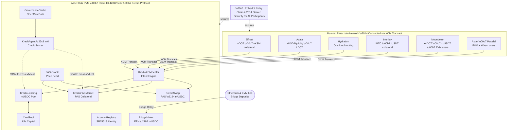
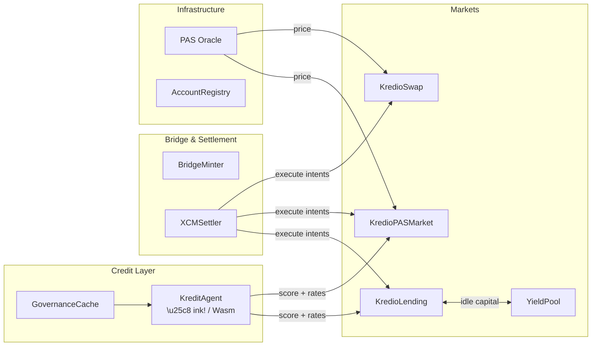

```
 ██╗  ██╗██████╗ ███████╗██████╗ ██╗ ██████╗ 
 ██║ ██╔╝██╔══██╗██╔════╝██╔══██╗██║██╔═══██╗
 █████╔╝ ██████╔╝█████╗  ██║  ██║██║██║   ██║
 ██╔═██╗ ██╔══██╗██╔══╝  ██║  ██║██║██║   ██║
 ██║  ██╗██║  ██║███████╗██████╔╝██║╚██████╔╝
 ╚═╝  ╚═╝╚═╝  ╚═╝╚══════╝╚═════╝ ╚═╝ ╚═════╝
```

# Kredio — On-Chain Credit Protocol for the Polkadot Ecosystem

> **Testnet Live** · Polkadot Asset Hub Paseo Testnet · Chain ID `420420417`
> *Mainnet deployment targets Polkadot Asset Hub with full parachain interconnectivity across the Polkadot ecosystem.*

Kredio is a decentralised lending and credit protocol built natively on **Polkadot Asset Hub EVM**. It introduces on-chain, deterministic credit scoring to DeFi — computed by an ink!/Wasm smart contract — so every borrower's risk profile evolves with their behaviour and unlocks progressively better terms over time.

---

## Contents

1. [What is Kredio?](#what-is-kredio)
2. [Why Polkadot?](#why-polkadot)
3. [Mainnet Vision — The Polkadot Credit Layer](#mainnet-vision--the-polkadot-credit-layer)
4. [Protocol Architecture](#protocol-architecture)
5. [KreditAgent — On-Chain Credit Scoring](#kreditagent--on-chain-credit-scoring)
6. [Credit Tiers](#credit-tiers)
7. [Markets](#markets)
8. [Cross-Chain Bridge](#cross-chain-bridge)
9. [XCM Intent Settlement](#xcm-intent-settlement)
10. [Account Registry & Identity](#account-registry--identity)
11. [Yield Strategy](#yield-strategy)
12. [Deployed Contracts (Paseo Testnet)](#deployed-contracts-paseo-testnet)
13. [Repository](#repository)
14. [Roadmap](#roadmap)

---

## What is Kredio?

DeFi lending today treats every participant identically. A first-time user and a veteran with twelve successful repayments face the same collateral requirements and the same interest rate — because the protocol has no memory.

Kredio changes this. A fully on-chain credit score, computed from verifiable protocol history by a tamper-proof ink! smart contract, evolves with every interaction. Your score — earned through repayment discipline, lending volume, and account longevity — unlocks:

- **Lower collateral requirements** — trusted borrowers lock less capital per dollar borrowed.
- **Reduced interest rates** — creditworthy accounts pay significantly less.
- **Tier progression** — ANON → BRONZE → SILVER → GOLD → PLATINUM → DIAMOND.

The protocol runs on **Polkadot Asset Hub** (chain ID `420420417`), a shared-security parachain combining Substrate's native asset infrastructure with a full EVM execution environment, settled by Polkadot relay chain validators.

---

## Why Polkadot?

Polkadot provides capabilities uniquely suited to a credit protocol:

### Shared Security
Asset Hub inherits Polkadot's relay chain security. Every lending transaction is validated by the same validator set securing the entire Polkadot network — without Kredio needing to bootstrap its own.

### XCM — Cross-Consensus Messaging
Polkadot's native interoperability standard lets any parachain communicate and transfer assets trustlessly. `KredioXCMSettler` receives XCM Transact calls from connected parachains, enabling users to borrow, repay, and manage positions on Kredio without leaving their native chain or switching wallets.

### ink! + EVM Hybrid Execution
Asset Hub supports EVM (Solidity) and Wasm (ink!) contracts side by side. Kredio's credit scoring engine — the `KreditAgent` — is an ink! Wasm contract invoked by Solidity market contracts via low-level SCALE-encoded cross-VM calls. This is unique to Polkadot's runtime.

### SR25519 Identity
Asset Hub's SR25519 precompile enables on-chain verification of Substrate (Talisman/Polkadot.js) signatures, allowing `KredioAccountRegistry` to cryptographically link a user's Substrate identity to their EVM address — enabling cross-chain credit attribution.

### Governance-Enriched Credit
Polkadot's OpenGov creates an on-chain civic participation record. `GovernanceCache` stores vote history and conviction data, ready for integration into the credit model — rewarding active governance participants with better borrowing terms.

---

## Mainnet Vision — The Polkadot Credit Layer

On testnet today, Kredio operates as a standalone protocol on Asset Hub. On mainnet, the architecture extends to become a **unified credit marketplace for the entire Polkadot ecosystem** — where liquidity, users, and collateral from every major parachain converge into a single credit layer through XCM. No parachain user needs to change chains, switch wallets, or bridge assets manually. A single XCM extrinsic from their home chain is enough to participate in Kredio.



The vision: Bifrost users bring liquid staking derivatives (vDOT, vKSM) as collateral. Interlay users bring iBTC. Hydration's deep omnipool becomes a yield destination. Acala's aUSD deepens stablecoin liquidity. Moonbeam's large EVM user base can access credit without leaving their familiar environment. Every parachain contributes liquidity and users to one unified marketplace — unobtrusive, composable, and trustless.

---

## Protocol Architecture



| Layer | Contract | Purpose |
|-------|----------|---------|
| Scoring | `KreditAgent` (ink!) | Deterministic credit score 0–100 from on-chain history |
| Lending | `KredioLending` | mUSDC collateral → mUSDC loan pool with yield routing |
| Collateral | `KredioPASMarket` | Native PAS collateral → mUSDC loans, oracle-priced |
| Swap | `KredioSwap` | Instant PAS → mUSDC at oracle price, 0.3% fee |
| Bridge | `EthBridgeInbox` + `KredioBridgeMinter` | ETH on source chain → mUSDC on Asset Hub |
| Intent Engine | `KredioXCMSettler` | Decodes & executes XCM Transact payloads from parachains |
| Identity | `KredioAccountRegistry` | SR25519 Substrate key ↔ EVM address, nonce-protected |
| Governance | `GovernanceCache` | On-chain OpenGov participation cache |
| Yield | `YieldPool` | External yield destination for idle lending capital |
| Oracle | `PASOracle` | Chainlink-compatible on-chain PAS/USD price feed |

---

## KreditAgent — On-Chain Credit Scoring

The `KreditAgent` is an **ink! Wasm smart contract** that computes a deterministic credit score (0–100) from four fully on-chain inputs:

| Input | Source | Max Weight |
|-------|--------|------------|
| Repayment count | Protocol contract storage | 55 pts |
| Liquidation count | Protocol contract storage | Up to −55 pts penalty |
| Deposit tier (0–7) | Lifetime cumulative deposits | 35 pts |
| Account age | Blocks since first deposit | 10 pts |

Solidity market contracts invoke the scorer via **low-level SCALE-encoded `staticcall`** — a cross-VM technique unique to Asset Hub's hybrid runtime. The ABI selectors are hardcoded constants derived from ink! message hashes, making every credit decision fully deterministic with no off-chain dependency.

Deploying scoring logic as Wasm gives Polkadot-specific advantages: ink! contracts are upgradeable in place without redeploying the dependent EVM market contracts, and future XCM messages can invoke the scorer directly from other parachains.

---

## Credit Tiers

| Tier | Score Range | Collateral Ratio | Interest Rate |
|------|-------------|------------------|---------------|
| ANON | 0 – 14 | 200% | 15% APR |
| BRONZE | 15 – 29 | 175% | 12% APR |
| SILVER | 30 – 49 | 150% | 10% APR |
| GOLD | 50 – 64 | 130% | 8% APR |
| PLATINUM | 65 – 79 | 120% | 6% APR |
| DIAMOND | 80 – 100 | 110% | 4% APR |

Scores are computed live at borrow time — no off-chain snapshot, no oracle delay. Collateral ratio and interest rate are locked into each position at open and stored on-chain.

---

## Markets

### KredioLending (mUSDC Collateral Market)
- Lenders deposit mUSDC into a shared pool and earn yield.
- Borrowers deposit mUSDC as collateral and borrow against it at their credit-tier rate.
- Idle capital in the pool is automatically routed to the yield strategy by the backend service, maximising lender returns.
- Interest is distributed to lenders in real time via an accumulator (`accYieldPerShare`) — lenders can harvest at any time.

### KredioPASMarket (PAS Collateral Market)
- Borrowers deposit native PAS tokens as collateral.
- The oracle provides a live PAS/USD price (8-decimal Chainlink-compatible format).
- Loans are issued in mUSDC at the borrower's credit-tier LTV ratio (up to 65% for DIAMOND).
- A staleness limit protects borrowers from acting on stale prices — the backend oracle service self-aligns its tick interval to stay within this limit.
- Liquidation: when a position's collateral value × LTV drops below the outstanding debt, any caller can liquidate and receive the collateral plus an 8% bonus.

---

## Cross-Chain Bridge (ETH → Hub)

Kredio includes a two-contract bridge allowing users to bring ETH liquidity from Ethereum (and future EVM chains) into the Polkadot ecosystem as mUSDC:

1. **EthBridgeInbox** (deployed on Ethereum Sepolia) — accepts ETH deposits within protocol-defined size limits, emits an `EthDeposited` event.
2. **KredioBridgeMinter** (deployed on Asset Hub) — the backend relayer monitors source chains for `EthDeposited` events, cross-checks the ETH/USD price against Chainlink and CoinGecko (within a 2% tolerance), and calls `processDeposit()` on the Minter to mint the equivalent mUSDC minus a 0.2% bridge fee.

The bridge is deliberately simple and operator-controlled today. On mainnet, this would be replaced by a trustless bridge using light-client proofs or a Polkadot-native XCM reserve transfer — the current design provides the UX and flow while the trustless infrastructure matures.

---

## XCM Intent Settlement

`KredioXCMSettler` is the on-chain engine that allows Polkadot parachains to interact with Kredio without users ever leaving their native chain.

An intent is a compact encoded payload specifying the action type and parameters:

| Intent | Action |
|--------|--------|
| `DEPOSIT_COLLATERAL` | Post PAS collateral on KredioPASMarket |
| `BORROW` | Draw mUSDC against deposited collateral |
| `REPAY` | Repay outstanding debt |
| `DEPOSIT_LEND` | Supply mUSDC liquidity to the lending pool |
| `SWAP_AND_LEND` | Swap PAS to mUSDC and deposit in one step |
| `SWAP_AND_BORROW_COLLATERAL` | Swap and use as PAS market collateral atomically |
| `WITHDRAW_COLLATERAL` | Retrieve posted collateral |
| `FULL_EXIT` | Repay debt + withdraw collateral in one step |

The settler is invoked via an XCM `Transact` call dispatched by an authorised parachain. Because Asset Hub's EVM shares state with the Substrate runtime, the call lands in the same block, with full ACID guarantees.

---

## Account Registry & Identity

`KredioAccountRegistry` provides on-chain identity binding between:
- A user's **EVM address** (MetaMask / any EIP-1193 wallet)
- Their **Substrate (SR25519) public key** (Polkadot.js / Talisman)

When the SR25519 precompile is enabled on Asset Hub EVM, linking requires a signature from the Substrate key over a structured message containing the EVM address and a replay-preventing nonce. Without the precompile, an authorised attester (admin-controlled multisig in production) can perform the link.

This registry enables:
- **Phase 4 governance score enrichment** — the GovernanceCache data is associated with the correct EVM borrower.
- **Cross-chain position attribution** — XCM-originated actions tracked back to the originating parachain account.
- **Future DAO membership gating** — protocol governance linked to Polkadot OpenGov participation.

---

## Yield Strategy

The backend yield strategy service monitors the `KredioLending` pool's utilisation in real time and automatically rebalances idle capital:

| Pool Zone | Utilisation | Action |
|-----------|------------|--------|
| IDLE | < 40% | Invest a portion of idle capital into the external yield source |
| NORMAL | 40% – 65% | Hold current allocation |
| TIGHT | 65% – 80% | Pull back invested capital to ensure liquidity |
| EMERGENCY | > 80% | Pull all invested capital back immediately |

The strategy respects a minimum 20% liquidity buffer at all times and applies a dead-band of 100 mUSDC to avoid dust transactions. Accrued yield is automatically claimed — at either a threshold of 10 mUSDC pending or every hour (whichever comes first) — and routed back through the lending contract's interest distributor so lenders receive their share without any manual action.

---

## Deployed Contracts (Paseo Testnet)

Network: **Polkadot Asset Hub Testnet** — RPC `https://eth-rpc-testnet.polkadot.io/` — Chain ID `420420417`

| Contract | Address |
|----------|---------|
| KredioLending | `0x1eDaD1271FB9d1296939C6f4Fb762752b041C64E` |
| KredioPASMarket | `0x0F90Fe6141AC29a6031C3ae2155749e9f38a0174` |
| KredioXCMSettler | `0xbaaE8f7b97ac387DE8C433A218d63166Ce104Bb1` |
| KredioAccountRegistry | `0xBf7ac0e6f0024ED0F2Cf2efb3669E7c389258BFf` |
| KredioSwap | `0xaF1d183F4550500Beb517A3249780290A88E6e39` |
| KreditAgent (ink!) | `0x8c13E6fFDf27bB51304Efff108C9B646d148E5F3` |
| PAS/USD Oracle | `0x1494432a8Af6fa8c03C0d7DD7720E298D85C55c7` |
| USD Coin (mUSDC) | `0x5998cE005b4f3923c988Ae31940fAa1DEAC0c646` |
| GovernanceCache | `0xe4DE7eadE2c0A65BdA6863Ad7bA22416c77F3e55` |
| YieldPool | `0x1dB4Faad3081aAfe26eC0ef6886F04f28D944AAB` |

Explorer: `https://blockscout-testnet.polkadot.io`
Faucet: `https://faucet.polkadot.io/`

---

## Repository

| Layer | Documentation |
|-------|---------------|
| Smart Contracts | [contracts/README.md](contracts/README.md) — Solidity + ink!, build, deploy, contract reference |
| Backend Service | [backend/README.md](backend/README.md) — oracle, bridge relayer, yield automator, REST API, env |
| Frontend dApp | [frontend/README.md](frontend/README.md) — pages, hooks, wagmi config, env |

---


## Roadmap

| Phase | Status | Description |
|-------|--------|-------------|
| Phase 1 | ✅ Complete | KreditAgent scoring, KredioLending, KredioPASMarket, KredioSwap, oracle feeder |
| Phase 2 | ✅ Complete | Liquidation engine, governance cache integration, interest distribution |
| Phase 3 | ✅ Complete | KredioXCMSettler, KredioAccountRegistry, ETH bridge, yield strategy |
| Phase 4 | 🔄 Planned | `onBehalf()` variants for per-user XCM positions, governance score enrichment, SR25519 precompile integration |
| Phase 5 | 🔄 Planned | Trustless bridge via XCM reserve transfers, decentralised oracle via Acurast, multi-parachain collateral |
| Phase 6 | 🔄 Planned | Cross-parachain credit history aggregation — unified credit score across Bifrost, Acala, Moonbeam; insurance pool via governance vote |
