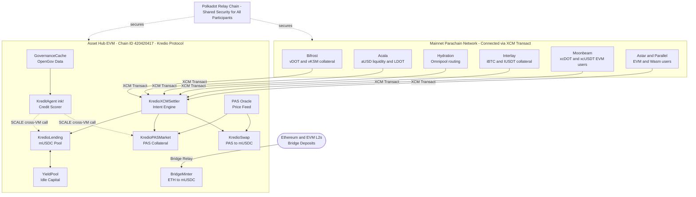

```
 ██╗  ██╗██████╗ ███████╗██████╗ ██╗ ██████╗ 
 ██║ ██╔╝██╔══██╗██╔════╝██╔══██╗██║██╔═══██╗
 █████╔╝ ██████╔╝█████╗  ██║  ██║██║██║   ██║
 ██╔═██╗ ██╔══██╗██╔══╝  ██║  ██║██║██║   ██║
 ██║  ██╗██║  ██║███████╗██████╔╝██║╚██████╔╝
 ╚═╝  ╚═╝╚═╝  ╚═╝╚══════╝╚═════╝ ╚═╝ ╚═════╝
```

# Kredio - DeFi gives borrowers memory.

DeFi lending treats every participant identically. A veteran with twelve repayments and a first-time user face the same collateral requirements and the same interest rate - because the protocol has no memory.

**Kredio gives the protocol memory.**

A tamper-proof ink! smart contract scores every borrower from on-chain history alone - repayments, volume, and tenure. Your score unlocks lower collateral requirements and lower interest rates. Earn better terms through behaviour, not through identity.

> **Live on Polkadot Asset Hub Paseo Testnet** · Chain ID `420420417`  
> Verify on-chain: [`0x1eDaD1271...`](https://blockscout-testnet.polkadot.io/address/0x61c6b46f5094f2867Dce66497391d0fd41796CEa) · Explorer: [blockscout-testnet.polkadot.io](https://blockscout-testnet.polkadot.io)

---

## Contents

1. [How It Works](#how-it-works)
2. [Credit Tiers](#credit-tiers)
3. [Why Polkadot?](#why-polkadot)
4. [Protocol Architecture](#protocol-architecture)
5. [KreditAgent - On-Chain Credit Scoring](#kreditagent--on-chain-credit-scoring)
6. [AI Scoring Layer](#ai-scoring-layer)
7. [Markets](#markets)
8. [Cross-Chain Bridge](#cross-chain-bridge)
9. [XCM Intent Settlement](#xcm-intent-settlement)
10. [Account Registry & Identity](#account-registry--identity)
11. [Mainnet Vision - The Polkadot Credit Layer](#mainnet-vision--the-polkadot-credit-layer)
12. [Deployed Contracts](#deployed-contracts-paseo-testnet)
13. [Security & Trust Model](#security--trust-model)
14. [Roadmap](#roadmap)
15. [Repository](#repository)

---

## How It Works

**1. Alice arrives on Asset Hub with 500 PAS.**  
Her score is 0 - ANON tier. She deposits PAS as collateral and borrows 150 mUSDC at **15% APR** (200% collateral ratio). Standard terms.

**2. She repays after 30 days.**  
One repayment → +8 score points → **BRONZE**. Her next borrow: 175% collateral, 12% APR. The protocol noticed.

**3. After 8 repayments, she reaches SILVER.**  
Collateral drops to 150%. She's borrowing $1 for every $1.50 locked - not $2. Real capital efficiency, earned through behaviour.

**4. At PLATINUM (65+ score), Alice borrows against PAS at 6% APR.**  
The same collateral that would have cost 200% at ANON now costs 120%. Every repayment over two years compounded into a 9% rate reduction.

**5. Meanwhile, lenders in the mUSDC pool are earning more than the base rate.**  
When utilisation drops below 40%, idle capital is automatically deployed to an external yield source. Lenders earn more without any extra action.

**6. A bad actor gets liquidated.**  
When a position's health ratio drops below 1.0, any caller can liquidate it and receive the collateral plus an **8% bonus**. Open liquidation keeps the pool solvent - no governance vote, no delay.

All of this runs in live, verified smart contracts on Polkadot Asset Hub testnet **right now**.

---

## Credit Tiers

The core product in one view:

| Tier | Score | Collateral Ratio¹ | Interest Rate |
|------|-------|-------------------|---------------|
| ANON | 0 – 14 | 200% | 15% APR |
| BRONZE | 15 – 29 | 175% | 12% APR |
| SILVER | 30 – 49 | 150% | 10% APR |
| GOLD | 50 – 64 | 130% | 8% APR |
| PLATINUM | 65 – 79 | 120% | 6% APR |
| DIAMOND | 80 – 100 | 110% | 4% APR |

> ¹ Collateral Ratio = collateral required per unit borrowed. 200% means $2 locked to borrow $1. The ratio improves as score grows.

Scores are computed live at borrow time - no off-chain snapshot, no oracle delay. Collateral ratio and interest rate are locked into each position at open and stored on-chain.

---

## Why Polkadot?

Not *"why we chose Polkadot"* - but **what Polkadot gives Kredio's users that no other chain can**.

### ink! + EVM Hybrid Execution - Unique to Polkadot

The `KreditAgent` is an ink! Wasm contract **invoked by Solidity market contracts via SCALE-encoded cross-VM `staticcall`** - in the same block, with shared state. A Solidity contract reading from a live Wasm contract atomically is unique to Polkadot's hybrid Asset Hub runtime. It means scoring logic can be upgraded without redeploying the lending markets, and the scorer can be queried directly by XCM calls from other parachains in the future.

### Credit Positions Accessible from Any Parachain

Polkadot's XCM standard lets any parachain send a Transact call to Asset Hub. `KredioXCMSettler` receives these intents and executes them inside Kredio - so a Moonbeam user can open a borrow and a Bifrost user can supply collateral **without switching chains, bridging manually, or leaving their wallet**.

### SR25519 Identity - Your Substrate Wallet as On-Chain Proof

`KredioAccountRegistry` links an EVM address to a Substrate (SR25519) key with cryptographic on-chain verification. Your Polkadot wallet identity - including OpenGov vote history and conviction - feeds directly into your credit profile. No other EVM protocol offers this.

### OpenGov Credit Enrichment

Polkadot's OpenGov creates a verifiable, on-chain civic record. `GovernanceCache` stores vote count and conviction data - Phase 4 integrates governance participation directly into the scoring model, rewarding active network citizens with better borrowing terms.

### Shared Security

Asset Hub inherits Polkadot relay chain security. Every transaction is validated by the same validator set securing the entire network - no bootstrapped validator set, no separate staking requirement.

---

## Protocol Architecture

| Layer | Contract | Purpose |
|-------|----------|---------|
| Scoring | `KreditAgent` (ink!) | Deterministic credit score 0–100 from on-chain history || Neural Scoring | `NeuralScorer` (PVM) | Weighted neural cross-validation of the deterministic score; emits confidence delta |
| Risk Assessment | `RiskAssessor` (PVM) | Real-time liquidation risk per position - single and 16-position batch modes |
| Yield Intelligence | `YieldMind` (PVM) | Computes optimal capital split across conservative / balanced / aggressive yield buckets || Lending | `KredioLending` | mUSDC collateral → mUSDC loan pool with yield routing |
| Collateral | `KredioPASMarket` | Native PAS collateral → mUSDC loans, oracle-priced |
| Swap | `KredioSwap` | Instant PAS → mUSDC at oracle price, 0.3% fee |
| Bridge | `EthBridgeInbox` + `KredioBridgeMinter` | ETH on source chain → mUSDC on Asset Hub |
| Intent Engine | `KredioXCMSettler` | Decodes & executes XCM Transact payloads from parachains |
| Identity | `KredioAccountRegistry` | SR25519 Substrate key ↔ EVM address, nonce-protected |
| Governance | `GovernanceCache` | On-chain OpenGov participation cache |
| Yield | `YieldPool` | External yield destination for idle lending capital |
| Oracle | `PASOracle` | Chainlink-compatible on-chain PAS/USD price feed |

**Layered execution flow:** Infrastructure feeds Scoring → Scoring drives Markets → Markets settle via Bridge / XCM.

---

## KreditAgent - On-Chain Credit Scoring

> **The KreditAgent is an ink! Wasm contract invoked by Solidity via SCALE-encoded cross-VM calls - a technique unique to Polkadot's hybrid execution runtime. No other EVM chain supports this.**

Computes a deterministic score (0–100) from four fully on-chain inputs. Every input is protocol-verified - nothing is self-reported:

| Input | How it's verified | Max Weight |
|-------|-------------------|------------|
| Repayment count | Protocol storage, incremented only on successful `repay()` | 55 pts |
| Liquidation count | Protocol storage, incremented only at liquidation event | up to −55 pts penalty |
| Deposit tier (0–7) | Derived from lifetime cumulative deposit volume on-chain | 35 pts |
| Account age | Block number delta since first deposit, from contract storage | 10 pts |

Solidity market contracts invoke the scorer via hardcoded SCALE selector constants - `SEL_COMPUTE_SCORE = 0x3a518c00` - in a low-level `staticcall`. No off-chain dependency, no trust assumption. Every borrow computes a fresh score and locks the resulting collateral ratio and rate into the position at open.

**Upgrade path:** Wasm contracts on Asset Hub are upgradeable in place. The scoring algorithm can evolve - incorporating governance data in Phase 4, cross-chain history in Phase 6 - without redeploying `KredioLending` or `KredioPASMarket`.

---

## AI Scoring Layer

Three ink! PVM contracts extend the base `KreditAgent` with a continuous AI-layer assessment running against every active borrower position. Each contract emits a permanent on-chain event after every computation.

**NeuralScorer** independently derives a weighted neural score from the same four on-chain inputs - repayments, liquidations, deposit tier, and account age - and publishes the delta versus the deterministic score as a confidence measure. When both models converge, the borrower's credit profile carries a high-confidence signal.

**RiskAssessor** monitors live liquidation risk for each open position, computing the liquidation probability, estimated blocks before the position breaches its threshold, and a recommended collateral top-up in atomic units. Supports single-position and batch-of-16 modes for efficient assessment of the entire borrower pool.

**YieldMind** computes the optimal capital allocation across three yield buckets - conservative (6.5% APY), balanced (11% APY), and aggressive (18% APY) - given current pool utilisation, average borrower credit quality, and recent PAS/USD price volatility. Its output guides the yield strategy rebalancing decisions.

All three contracts are called by the backend AI Engine on every `KredioLending` event and during a 50-block (~5-minute) periodic sweep of the active borrower pool.

---

## Markets

### KredioLending (mUSDC Collateral Market)
- Lenders deposit mUSDC and earn yield from borrower interest and yield strategy returns.
- Borrowers post mUSDC as collateral and borrow at their credit-tier rate.
- Interest distributes to all lenders in real time via an accumulator (`accYieldPerShare`) - harvestable at any time, no gas overhead per lender.

> **Intelligent Yield** - When pool utilisation drops below 40%, idle capital is automatically deployed to an external yield source. When borrowers return, it's recalled instantly. Lenders earn more without doing anything differently.

### KredioPASMarket (PAS Collateral Market)
- Borrowers post native PAS as collateral (`payable` deposit, no ERC-20 approve step).
- Live PAS/USD price from the on-chain Chainlink-compatible oracle determines LTV.
- Maximum LTV: **65%** at DIAMOND tier.
- Liquidation bonus paid to liquidator: **8%** of collateral.
- Oracle staleness guard: borrows and liquidations revert if oracle data exceeds the staleness limit - the backend oracle service self-aligns its tick interval to always stay within this window.

---

## Cross-Chain Bridge (ETH → Hub)

Two contracts, one flow:

1. **`EthBridgeInbox`** (Ethereum Sepolia `0x` - see [addresses-latest.md](contracts/addresses-latest.md)) - accepts ETH deposits, emits `EthDeposited(depositor, ethAmount, hubRecipient)`.
2. **`KredioBridgeMinter`** (Asset Hub - see [addresses-latest.md](contracts/addresses-latest.md)) - backend relayer cross-checks ETH/USD price between CoinGecko and Chainlink on-chain feed (rejects if they diverge > 2%), then mints mUSDC minus a **0.2% bridge fee** to the Hub recipient.

**On testnet:** uses a trusted relayer. The mint key is controlled by the backend service.  
**On mainnet:** replaced by XCM reserve transfers. No relayer key, no new trust assumptions.

---

## XCM Intent Settlement

Live on testnet - any parachain with XCM Transact capability can submit intents to [`0xE0C102eCe5F6940D5CAF77B6980456F188974e52`](https://blockscout-testnet.polkadot.io/address/0xE0C102eCe5F6940D5CAF77B6980456F188974e52) today.

`KredioXCMSettler` decodes compact encoded intent payloads from any connected parachain and executes them inside the Kredio protocol. The call lands in the same block as the XCM, with full ACID guarantees.

| Intent | Action |
|--------|--------|
| `DEPOSIT_COLLATERAL` | Post PAS collateral on KredioPASMarket |
| `BORROW` | Draw mUSDC against deposited collateral |
| `REPAY` | Repay outstanding debt |
| `DEPOSIT_LEND` | Supply mUSDC liquidity to the lending pool |
| `SWAP_AND_LEND` | Swap PAS to mUSDC and deposit in one step |
| `SWAP_AND_BORROW_COLLATERAL` | Swap and use as PAS market collateral atomically |
| `WITHDRAW_COLLATERAL` | Retrieve posted collateral |
| `FULL_EXIT` | Repay debt + withdraw collateral in one XCM call |

`FULL_EXIT` is the standout: a single XCM extrinsic from a home parachain closes an entire Kredio position and returns collateral - no multi-step manual flow for cross-chain users.

---

## Account Registry & Identity

`KredioAccountRegistry` provides on-chain identity binding between a user's EVM address and their Substrate (SR25519) public key. When the SR25519 precompile is active on Asset Hub EVM, linking requires a cryptographic signature over a structured message containing the EVM address and a nonce. Replay attacks are prevented by nonce increment on both link and unlink.

This registry powers:
- **Phase 4 governance score enrichment** - GovernanceCache vote data attributed to the correct EVM borrower.
- **Cross-chain position attribution** - XCM-originated actions tracked to their originating parachain account.
- **Future DAO membership gating** - protocol governance linked to Polkadot OpenGov participation.

---

## Mainnet Vision - The Polkadot Credit Layer

**Why would Bifrost, Acala, or Moonbeam users use Kredio instead of their native protocol?**

**Portable credit history.** A Moonbeam user with 18 months of on-chain history and 8 repayments on Kredio borrows at 4% APR - DIAMOND tier - without bridging, without switching wallets, without starting their credit score from scratch. Their history follows them. Every parachain Kredio connects to inherits the same credit layer.

On mainnet, each parachain adds a distinct form of value:

- **Bifrost** - vDOT and vKSM as collateral; liquid staking derivatives enter the credit system
- **Acala** - aUSD deepens stablecoin liquidity; LDOT adds a collateral type
- **Hydration** - Omnipool as a yield destination for idle lending capital
- **Interlay** - iBTC and IUSDT bring Bitcoin liquidity into Kredio's borrow markets
- **Moonbeam** - large EVM user base accesses Kredio credit without leaving their familiar environment
- **Astar / Parallel** - hybrid EVM + Wasm users add borrower volume and dApp diversity



---

## Deployed Contracts (Paseo Testnet)

**Network:** Polkadot Asset Hub Testnet · RPC `https://eth-rpc-testnet.polkadot.io/` · Chain ID `420420417`

| Contract | Address |
|----------|---------|
| KredioLending | [`0x61c6b46f5094f2867Dce66497391d0fd41796CEa`](https://blockscout-testnet.polkadot.io/address/0x61c6b46f5094f2867Dce66497391d0fd41796CEa) |
| KredioPASMarket | [`0x5617dBa1b13155fD6fD62f82ef6D9e8F0F3B0E86`](https://blockscout-testnet.polkadot.io/address/0x5617dBa1b13155fD6fD62f82ef6D9e8F0F3B0E86) |
| KredioXCMSettler | [`0xE0C102eCe5F6940D5CAF77B6980456F188974e52`](https://blockscout-testnet.polkadot.io/address/0xE0C102eCe5F6940D5CAF77B6980456F188974e52) |
| KredioAccountRegistry | [`0xe3603f70ACeBe6A7f3975cf3Edbd12EfeA78aDeA`](https://blockscout-testnet.polkadot.io/address/0xe3603f70ACeBe6A7f3975cf3Edbd12EfeA78aDeA) |
| KredioSwap | [`0xaF1d183F4550500Beb517A3249780290A88E6e39`](https://blockscout-testnet.polkadot.io/address/0xaF1d183F4550500Beb517A3249780290A88E6e39) |
| KreditAgent (ink!) | [`0x8c13E6fFDf27bB51304Efff108C9B646d148E5F3`](https://blockscout-testnet.polkadot.io/address/0x8c13E6fFDf27bB51304Efff108C9B646d148E5F3) |
| PAS/USD Oracle | [`0x1494432a8Af6fa8c03C0d7DD7720E298D85C55c7`](https://blockscout-testnet.polkadot.io/address/0x1494432a8Af6fa8c03C0d7DD7720E298D85C55c7) |
| USD Coin (mUSDC) | [`0x5998cE005b4f3923c988Ae31940fAa1DEAC0c646`](https://blockscout-testnet.polkadot.io/address/0x5998cE005b4f3923c988Ae31940fAa1DEAC0c646) |
| GovernanceCache | [`0xe4DE7eadE2c0A65BdA6863Ad7bA22416c77F3e55`](https://blockscout-testnet.polkadot.io/address/0xe4DE7eadE2c0A65BdA6863Ad7bA22416c77F3e55) |
| YieldPool | [`0x12CEF08cb9D58357A170ee2fA70b3cE2c0419bd6`](https://blockscout-testnet.polkadot.io/address/0x12CEF08cb9D58357A170ee2fA70b3cE2c0419bd6) |
| NeuralScorer (PVM) | [`0xac6bd3ff3447d8d1689dd4f02899ff558f108e0d`](https://blockscout-testnet.polkadot.io/address/0xac6bd3ff3447d8d1689dd4f02899ff558f108e0d) |
| RiskAssessor (PVM) | [`0xdB9E48932E061D95E22370235ac3a35332d289f7`](https://blockscout-testnet.polkadot.io/address/0xdB9E48932E061D95E22370235ac3a35332d289f7) |
| YieldMind (PVM) | [`0x0b68fbfb596846e4f3a23da10365e0888a182ef3`](https://blockscout-testnet.polkadot.io/address/0x0b68fbfb596846e4f3a23da10365e0888a182ef3) |

Faucet (testnet PAS): [faucet.polkadot.io](https://faucet.polkadot.io/)

---

## Security & Trust Model

Honest about what is centralised today and how each component changes on mainnet:

| Component | Testnet (now) | Mainnet (target) |
|-----------|---------------|------------------|
| Oracle | Admin-controlled backend writes PAS/USD prices on-chain | Replaced by Acurast decentralised oracle computation (Phase 5) |
| Bridge minting | Trusted relayer key; `processDeposit` restricted to operator | Replaced by XCM reserve transfers - no relayer key required (Phase 5) |
| Governance data | Admin-written `GovernanceCache` - on-chain and auditable | Automated indexer via Subquery / Substrate RPC (Phase 4) |
| Credit scoring | Fully trustless ink! Wasm contract, no admin override path | No change required - already trustless |
| Liquidation | Open - any caller can liquidate undercollateralised positions | No change required - already permissionless |

The admin key controls: oracle price updates, bridge minting authorisation, and governance data writes. It does **not** control borrower credit scores, position terms once locked, or the liquidation mechanism.

---

## Roadmap

Phases 1–3 are shipped and running on testnet. Phases 4–6 reflect active development priorities.

| Phase | Status | Description |
|-------|--------|-------------|
| Phase 1 | ✅ Complete | KreditAgent scoring, KredioLending, KredioPASMarket, KredioSwap, oracle feeder |
| Phase 2 | ✅ Complete | Liquidation engine, governance cache integration, interest distribution |
| Phase 3 | ✅ Complete | KredioXCMSettler, KredioAccountRegistry, ETH bridge, yield strategy, PVM AI layer (NeuralScorer, RiskAssessor, YieldMind) |
| Phase 4 | ⏳ In Development | `onBehalf()` XCM position variants, governance score enrichment, SR25519 precompile integration |
| Phase 5 | 📋 Scoped | Trustless bridge via XCM reserve transfers, Acurast decentralised oracle, multi-parachain collateral types |
| Phase 6 | 💡 Research | Cross-parachain credit history aggregation - unified score across Bifrost, Acala, Moonbeam; insurance pool via governance vote |

### Phase 6 - The Long-Term Moat

Phase 6 is the feature that makes Kredio a protocol, not just an application. A borrower's credit history - repayments, volume, tenure - accumulated on any connected parachain aggregates into a single portable score. The score follows the user, not the chain.

A Moonbeam borrower's history counts on Asset Hub. An Acala lender's history counts on Bifrost. The longer a user builds their history, the more valuable their score becomes and the more expensive it is to walk away. That is a moat no single smart contract can create - it is a cross-chain network effect.

---

## Repository

| Layer | Documentation |
|-------|---------------|
| Smart Contracts | [contracts/README.md](contracts/README.md) - Solidity + ink!, build, deploy, contract reference |
| Backend Service | [backend/README.md](backend/README.md) - oracle, bridge relayer, yield automator, REST API, env |
| Frontend dApp | [frontend/README.md](frontend/README.md) - pages, hooks, wagmi config, env |
