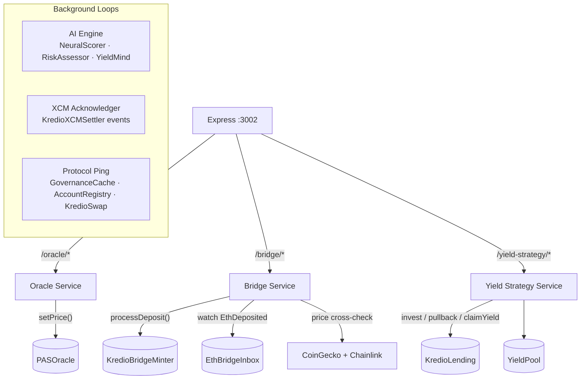

# Kredio Backend

Node.js service layer for the Kredio protocol. A single Express process runs on port `3002`, hosts three REST-accessible services, and starts three concurrent background loops - all connected to smart contracts on Polkadot Asset Hub EVM.

---

## Architecture



---

## Directory Structure

```
backend/
├── server.js                       ← Express entry point, service startup
├── config.js                       ← Environment-driven configuration
├── chainlink.js                    ← Chainlink ETH/USD feed reader
├── abis/                           ← Contract ABI JSON files
├── data/
│   └── pas_oracle_feed.json        ← Historical PAS/USD price sequence (DEMO mode)
├── routes/
│   ├── oracle.js                   ← /oracle/* route handlers
│   ├── bridge.js                   ← /bridge/* route handlers
│   └── yield-strategy.js           ← /yield-strategy/* route handlers
├── services/
│   ├── oracle-service.js           ← PAS/USD oracle feeder loop
│   ├── bridge-service.js           ← ETH bridge relayer
│   └── yield-strategy-service.js   ← Pool utilisation rebalancer
└── src/
    ├── aiEngine.js                 ← Event-driven PVM contract caller
    ├── xcmAcknowledger.js          ← XCM intent event monitor
    └── protocolPing.js             ← Background non-core contract activity
```

---

## Services

### Oracle Service - `services/oracle-service.js`

Feeds PAS/USD prices to the on-chain `PASOracle` contract at a configurable interval. Reads from a pre-loaded historical price sequence (`data/pas_oracle_feed.json`) and writes each tick on-chain.

**Modes:**
- `DEMO` - ticks every 60 seconds, cycling through the feed file. Designed for development and demonstrations.
- `REAL` - ticks every 15 minutes. Replace the feed source with a live aggregator for production.

On startup the service reads the oracle contract's `stalenessLimit` and caps its tick interval to 80% of that value, ensuring the oracle data never expires from the market contract's perspective.

**Crash simulation:** Exposes endpoints to inject a crash price (simulates a sharp collateral price drop for liquidation testing) and to recover. `KredioSwap` automatically halts swaps while the oracle is in crash mode.

---

### Bridge Service - `services/bridge-service.js`

Processes ETH deposits from the source chain and mints mUSDC on Asset Hub.

**Deposit flow:**
1. User deposits ETH to `EthBridgeInbox` on source chain - emits `EthDeposited(depositor, ethAmount, hubRecipient)`.
2. Frontend calls `POST /bridge/deposit` with `{ chainId, txHash, hubRecipient }`.
3. Service fetches the transaction receipt and validates the `EthDeposited` log.
4. ETH/USD price is cross-referenced between CoinGecko (30s TTL cache) and the on-chain Chainlink feed. Deposits are rejected if the two sources diverge by more than 2%.
5. mUSDC output: `ethAmount × ethUSD × (1 − bridgeFeeBps / 10000)`.
6. `KredioBridgeMinter.processDeposit()` is called on Asset Hub; mUSDC is minted to the recipient.

Replay protection is enforced by the contract: each source transaction hash can only be processed once.

---

### Yield Strategy Service - `services/yield-strategy-service.js`

Monitors `KredioLending` pool utilisation and automatically rebalances capital between the lending pool and the external yield source.

| Zone | Utilisation | Action |
|------|-------------|--------|
| IDLE | < 40% | Invest idle capital into yield pool |
| NORMAL | 40%–65% | Hold current allocation |
| TIGHT | 65%–80% | Partially recall invested capital |
| EMERGENCY | > 80% | Immediately recall all invested capital |

Safety constraints: a minimum buffer of 20% of total deposits is always kept liquid; rebalance deltas below 100 mUSDC are ignored to avoid dust transactions; a 2-minute cooldown between invest calls prevents rapid cycling on volatile utilisation.

Yield is claimed and injected into the lending pool when pending yield exceeds 10 mUSDC or the maximum claim interval (1 hour) elapses.

---

### AI Engine - `src/aiEngine.js`

Event-driven orchestrator for the three PVM ink! contracts. Listens to `KredioLending` events and calls the on-chain scoring layer in response.

**Event triggers:**

| Event | Action |
|-------|--------|
| `Borrowed` | `NeuralScorer.infer()` for the new borrower |
| `CollateralDeposited` | `RiskAssessor.assess_position()` |
| `Liquidated` | `RiskAssessor.assess_position()` |
| `Deposited` / `YieldHarvested` | `YieldMind.compute_allocation()` |

**Periodic sweep (every 50 blocks, ~5 minutes):** Calls all three PVM contracts for every active borrower. When no live borrowers are present, the deployer address is used as a sentinel to keep the contracts emitting on-chain events.

Each PVM call emits an on-chain event (`ScoreInferred`, `RiskAssessed`, `AllocationComputed`) visible on the block explorer.

---

### XCM Acknowledger - `src/xcmAcknowledger.js`

Polls `KredioXCMSettler` for `IntentSettled` and `IntentFailed` events and logs them for off-chain audit.

---

### Protocol Ping - `src/protocolPing.js`

Keeps three non-core contracts active with periodic background transactions. Contract addresses are hardcoded in the source and do not require env configuration.

| Contract | Address | Activity | Interval |
|----------|---------|----------|---------|
| `GovernanceCache` | `0xe4DE7eadE2c0A65BdA6863Ad7bA22416c77F3e55` | `setGovernanceData()` - writes governance vote counts | Every 60 blocks |
| `KredioAccountRegistry` | `0xe3603f70ACeBe6A7f3975cf3Edbd12EfeA78aDeA` | `attestedUnlink()` + `attestedLink()` cycle - emits `AccountLinked` / `AccountUnlinked` | Every 300 blocks |
| `KredioSwap` | `0xaF1d183F4550500Beb517A3249780290A88E6e39` | `quoteSwap()` + `reserveBalance()` view calls - logged locally | Every 50 blocks |

---

## REST API

**Base URL:** `http://localhost:3002`

### Health

| Method | Path | Description |
|--------|------|-------------|
| `GET` | `/health` | Returns `{ ok: true, ts, pid }` |

### Oracle

| Method | Path | Description |
|--------|------|-------------|
| `GET` | `/oracle/status` | Current oracle state: price, round, feed index, crash status |
| `GET` | `/oracle/next` | Force advance one price tick |
| `GET` | `/oracle/crash` | Inject a crash price |
| `GET` | `/oracle/recover` | Recover from crash mode |

### Bridge

| Method | Path | Description |
|--------|------|-------------|
| `GET` | `/bridge/quote?chainId=&ethAmount=` | Non-binding mUSDC quote for an ETH amount |
| `POST` | `/bridge/deposit` | Process a deposit. Body: `{ chainId, txHash, hubRecipient }` |
| `GET` | `/bridge/status?txHash=` | Look up a previously submitted deposit |

Rate limit on `/bridge/deposit`: 1 request per minute per IP.

### Yield Strategy

| Method | Path | Description |
|--------|------|-------------|
| `GET` | `/yield-strategy/status` | Current zone, utilisation, invested amount, last action |

---

## Environment Variables

```env
# ── Network ────────────────────────────────────────────────────────────────────
RPC=https://eth-rpc-testnet.polkadot.io/
SEPOLIA_RPC=https://rpc.sepolia.org

# ── Signing key ────────────────────────────────────────────────────────────────
KEY=<private_key_hex>                # Relayer / oracle wallet (no 0x prefix)

# ── Protocol contracts ─────────────────────────────────────────────────────────
ORACLE=0x1494432a8Af6fa8c03C0d7DD7720E298D85C55c7
MARKET_ADDR=0x5617dBa1b13155fD6fD62f82ef6D9e8F0F3B0E86
LENDING_ADDR=0x61c6b46f5094f2867Dce66497391d0fd41796CEa
YIELD_POOL_ADDR=0x12CEF08cb9D58357A170ee2fA70b3cE2c0419bd6

# ── Bridge ─────────────────────────────────────────────────────────────────────
MINTER_ADDR=0x...                    # KredioBridgeMinter on Asset Hub
INBOX_ADDR_11155111=0x...            # EthBridgeInbox on Ethereum Sepolia
BRIDGE_FEE_BPS=20                    # 0.2%

# ── AI Engine - PVM contracts ─────────────────────────────────────────────────
NEURAL_SCORER_ADDRESS=0xac6bd3ff3447d8d1689dd4f02899ff558f108e0d
RISK_ASSESSOR_ADDRESS=0xdB9E48932E061D95E22370235ac3a35332d289f7
YIELD_MIND_ADDRESS=0x0b68fbfb596846e4f3a23da10365e0888a182ef3

# ── Server ─────────────────────────────────────────────────────────────────────
PORT=3002
CORS_ORIGINS=http://localhost:3000   # Comma-separated; omit for dev (allow all)

# ── Oracle mode ────────────────────────────────────────────────────────────────
MODE=DEMO                            # DEMO | REAL
TICK_MS=60000                        # Override tick interval (ms)
CRASH_PRICE_8DEC=250000000           # Crash price in 8-decimal units

# ── Yield strategy ─────────────────────────────────────────────────────────────
YIELD_STRATEGY_ENABLED=true
INVEST_RATIO_BPS=5000                # Invest 50% of idle capital
MIN_BUFFER_BPS=2000                  # Always keep 20% of deposits liquid
INVEST_THRESHOLD_BPS=4000
PULLBACK_THRESHOLD_BPS=6500
EMERGENCY_THRESHOLD_BPS=8000
DEAD_BAND_USDC=100000000             # Ignore deltas < 100 mUSDC
CLAIM_THRESHOLD_USDC=10000000        # Claim yield when pending > 10 mUSDC
MAX_CLAIM_INTERVAL_MS=3600000        # Claim at least every 1 hour
INVEST_COOLDOWN_MS=120000            # Min 2 minutes between invest calls
STRATEGY_POLL_MS=30000
```

---

## Running Locally

```bash
cd backend
npm install
cp .env.example .env    # fill in KEY and contract addresses
node server.js
```

All six services start concurrently. The server is ready when you see the startup banner on `PORT` (default `3002`).

## Production Deployment

```bash
npm install -g pm2
pm2 start server.js --name kredio-backend
pm2 save
pm2 startup    # auto-restart on system reboot
```

Set `CORS_ORIGINS` to the deployed frontend domain. If running behind a reverse proxy, configure `trust proxy` in Express so rate limiting resolves real client IPs.

---

## Security Notes

- **Private key**: Store `KEY` in a secrets manager. Never commit it to version control.
- **CORS**: Always set `CORS_ORIGINS` explicitly in production.
- **Input validation**: All bridge route inputs are validated (hex format, length) before any on-chain call is made.
- **Price manipulation**: The bridge cross-references CoinGecko and Chainlink and rejects deposits when the two prices diverge by more than 2%.
- **Replay protection**: `KredioBridgeMinter` enforces one-time processing per source transaction hash - double-minting is impossible at the contract level.
