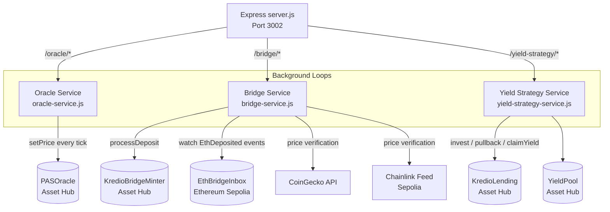
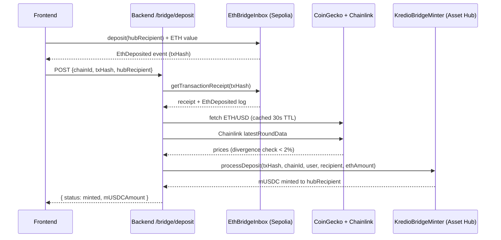

```
██████╗  █████╗  ██████╗██╗  ██╗███████╗███╗   ██╗██████╗ 
██╔══██╗██╔══██╗██╔════╝██║ ██╔╝██╔════╝████╗  ██║██╔══██╗
██████╔╝███████║██║     █████╔╝ █████╗  ██╔██╗ ██║██║  ██║
██╔══██╗██╔══██║██║     ██╔═██╗ ██╔══╝  ██║╚██╗██║██║  ██║
██████╔╝██║  ██║╚██████╗██║  ██╗███████╗██║ ╚████║██████╔╝
╚═════╝ ╚═╝  ╚═╝ ╚═════╝╚═╝  ╚═╝╚══════╝╚═╝  ╚═══╝╚═════╝ 
```

# Kredio Backend

Unified Node.js backend service for the Kredio protocol. Runs three concurrent services under a single Express process: a **PAS/USD oracle feeder**, an **ETH→mUSDC bridge relayer**, and an **intelligent yield strategy automator**.

---

## Table of Contents

1. [Overview](#overview)
2. [Architecture](#architecture)
3. [Directory Structure](#directory-structure)
4. [Services](#services)
   - [Oracle Service](#oracle-service)
   - [Bridge Service](#bridge-service)
   - [Yield Strategy Service](#yield-strategy-service)
5. [REST API](#rest-api)
6. [Environment Variables](#environment-variables)
7. [Running Locally](#running-locally)
8. [Running in Production](#running-in-production)
9. [Security Notes](#security-notes)

---

## Overview

The backend is a lightweight Node.js/Express server that handles off-chain automation the smart contracts cannot perform themselves:

- **Oracle Feeder** — reads from a pre-loaded PAS/USD price feed and writes each price tick on-chain to the `PASOracle` contract. In production this would be replaced by a decentralised oracle network (Chainlink or Acurast) deployed on Asset Hub.
- **Bridge Relayer** — monitors source-chain `EthBridgeInbox` contracts for deposit events, cross-checks the ETH/USD price against both CoinGecko and Chainlink for manipulation resistance, then calls `KredioBridgeMinter.processDeposit()` on Asset Hub to mint the equivalent mUSDC. On mainnet this role would be performed by a trustless light-client bridging system such as Snowbridge or XCM reserve transfers.
- **Yield Strategy Automator** — polls the `KredioLending` pool's utilisation rate and automatically routes idle capital into the external yield source and claims accrued yield back to the pool, maximising lender returns without any manual intervention.

---

## Architecture




All three services share a single `config.js` that reads every configuration value from environment variables, with safe defaults for local development.

---

## Directory Structure

```
backend/
├── server.js                  ← Express entry point, service startup
├── config.js                  ← Environment-driven configuration
├── chainlink.js               ← Chainlink ETH/USD feed reader (price verification)
├── package.json
├── abis/                      ← Compiled contract ABI JSON files
│   ├── EthBridgeInbox.json
│   ├── KredioBridgeMinter.json
│   ├── KredioLending.json
│   ├── KredioPASMarket.json
│   ├── MockPASOracle.json
│   └── MockYieldPool.json
├── data/
│   └── pas_oracle_feed.json   ← Historical PAS/USD price feed (DEMO mode)
├── routes/
│   ├── oracle.js              ← /oracle/* route handlers
│   ├── bridge.js              ← /bridge/* route handlers
│   └── yield-strategy.js      ← /yield-strategy/* route handlers
├── services/
│   ├── oracle-service.js      ← Oracle feeder loop + state cache
│   ├── bridge-service.js      ← Bridge relayer + quoting engine
│   └── yield-strategy-service.js ← Yield rebalancing loop
└── scripts/
    ├── test-full.js           ← Full end-to-end protocol test script
    └── wire-yield-pool.js     ← One-time yield pool wiring helper
```

---

## Services

### Oracle Service

`services/oracle-service.js`

Reads from `data/pas_oracle_feed.json` — a sequence of dated PAS/USD price entries — and writes each price to the on-chain `PASOracle` contract at a configurable tick interval.

**Modes:**
- `DEMO` (default) — ticks every 60 seconds using the pre-loaded historical feed, cycling through entries. Designed for demonstrations and integration testing.
- `REAL` — ticks every 15 minutes, suitable for connecting to a live price source. In a production deployment, real prices would be fetched from a decentralised oracle aggregator rather than the feed file.

**Self-alignment:** On startup the service reads the `PASOracle` contract's `stalenessLimit` and automatically caps its tick interval to 80% of that value — ensuring the oracle never goes stale from the market contract's perspective.

**Crash simulation:** The oracle supports an explicit crash mode where the price is set to a configured low value, simulating a collateral price crash for liquidation testing. The backend exposes endpoints to trigger and recover from crash mode.

**State caching:** The service maintains an in-memory state snapshot (price, round ID, feed index, crash status) served by the `/oracle/status` endpoint so the frontend can display live oracle state without polling the chain.

---

### Bridge Service

`services/bridge-service.js`

Implements an off-chain bridge relayer that processes ETH deposits from source chains and mints mUSDC on Asset Hub.

**Deposit flow:**
1. Frontend sends `POST /bridge/deposit` with `{ chainId, txHash, hubRecipient }`.
2. The service fetches the transaction receipt from the source chain and extracts the `EthDeposited(depositor, ethAmount, hubRecipient)` event from the `EthBridgeInbox` contract.
3. ETH/USD price is fetched from both **CoinGecko** (cached with 30-second TTL) and **Chainlink** (on-chain feed on Sepolia). If the two prices diverge by more than 2%, the deposit is rejected to prevent price manipulation.
4. mUSDC output is calculated as: `ethAmount × ethPriceUSD × (1 − bridgeFeeBps / 10000)`.
5. The service calls `KredioBridgeMinter.processDeposit()` on Asset Hub as the authorised relayer, which mints the calculated mUSDC to `hubRecipient`.




**Gas handling:** Asset Hub's Frontier EVM enforces a minimum priority fee. The bridge service explicitly sets `maxPriorityFeePerGas = maxFeePerGas` to avoid transaction rejections from under-priced tips.

**Retry logic:** All on-chain calls are wrapped in a retry helper with configurable attempts and delay, ensuring transient RPC errors do not silently drop deposits.

**Rate limiting:** The bridge route applies a 1-request-per-minute per-IP rate limit to the deposit endpoint.

**Quote endpoint:** `GET /bridge/quote?chainId=11155111&ethAmount=0.01` — returns a non-binding price quote without writing anything on-chain.

---

### Yield Strategy Service

`services/yield-strategy-service.js`

Monitors the `KredioLending` pool and automatically manages capital allocation between the lending pool and the external yield source.

**Utilisation zones:**

| Zone | Utilisation | Strategy |
|------|-------------|----------|
| IDLE | < 40% | Invest idle capital into yield source |
| NORMAL | 40%–65% | Maintain current allocation |
| TIGHT | 65%–80% | Partially pull back invested capital |
| EMERGENCY | > 80% | Immediately pull all invested capital |

**Decision logic (pure function):** Each tick computes a `{ action, amount, zone }` decision based on the current pool snapshot. The decision function is side-effect-free, making it easy to test in isolation.

**Safety constraints:**
- A minimum buffer (`MIN_BUFFER_BPS`, default 20%) of total deposits is always kept liquid.
- A dead-band (`DEAD_BAND_USDC`, default 100 mUSDC) ignores small imbalances to prevent dust transactions.
- An invest cooldown (`INVEST_COOLDOWN_MS`, default 2 minutes) prevents rapid-fire invest calls on volatile utilisation.

**Yield claiming:** Accrued yield is claimed when pending yield exceeds `CLAIM_THRESHOLD_USDC` (default 10 mUSDC) or the maximum claim interval (`MAX_CLAIM_INTERVAL_MS`, default 1 hour) elapses. Claimed yield is routed through `KredioLending._distributeInterest()` so all lenders receive their pro-rata share automatically.

**Polling:** Runs every `STRATEGY_POLL_MS` (default 30 seconds).

---

## REST API

### Health

| Method | Path | Description |
|--------|------|-------------|
| `GET` | `/health` | Returns `{ ok: true, ts, pid }` |

### Oracle

| Method | Path | Description |
|--------|------|-------------|
| `GET` | `/oracle/status` | Current oracle state: price, round, feed index, crash status |
| `GET` | `/oracle/next` | Manually advance one price tick |
| `GET` | `/oracle/crash` | Inject a price crash (sets price to `CRASH_PRICE`) |
| `GET` | `/oracle/recover` | Recover from crash mode |

### Bridge

| Method | Path | Description |
|--------|------|-------------|
| `GET` | `/bridge/quote?chainId=&ethAmount=` | Live ETH→mUSDC price quote (read-only) |
| `POST` | `/bridge/deposit` | Process a deposit; body: `{ chainId, txHash, hubRecipient }` |
| `GET` | `/bridge/status?txHash=` | Look up a processed deposit record |

**Rate limit on `/bridge/deposit`:** 1 request per minute per IP.

### Yield Strategy

| Method | Path | Description |
|--------|------|-------------|
| `GET` | `/yield-strategy/status` | Current strategy state: zone, utilisation, invested amount, last action |

---

## Environment Variables

Create a `.env` file in the `backend/` directory (or set variables in your deployment environment):

```env
# ── Network ────────────────────────────────────────────────────────────────
RPC=https://eth-rpc-testnet.polkadot.io/     # Asset Hub EVM RPC
SEPOLIA_RPC=https://rpc.sepolia.org          # Ethereum Sepolia RPC

# ── Signing key ─────────────────────────────────────────────────────────────
KEY=<private_key_hex>                        # Relayer/oracle wallet private key (no 0x)

# ── Contract addresses ───────────────────────────────────────────────────────
ORACLE=0x...                                 # PASOracle on Asset Hub
MINTER_ADDR=0x...                            # KredioBridgeMinter on Asset Hub
MARKET_ADDR=0x...                            # KredioPASMarket on Asset Hub
INBOX_ADDR_11155111=0x...                    # EthBridgeInbox on Ethereum Sepolia
LENDING_ADDR=0x...                           # KredioLending on Asset Hub
YIELD_POOL_ADDR=0x...                        # YieldPool on Asset Hub

# ── Server ───────────────────────────────────────────────────────────────────
PORT=3002
CORS_ORIGINS=http://localhost:3000           # Comma-separated allowed origins (omit = allow all)

# ── Oracle mode ──────────────────────────────────────────────────────────────
MODE=DEMO                                    # DEMO (feed file) | REAL (live source)
TICK_MS=60000                                # Override tick interval (ms)
CRASH_PRICE_8DEC=250000000                   # Crash price in 8-decimal format (default $2.50)

# ── Bridge ───────────────────────────────────────────────────────────────────
BRIDGE_FEE_BPS=20                            # Bridge fee in basis points (default 0.2%)

# ── Yield strategy ───────────────────────────────────────────────────────────
YIELD_STRATEGY_ENABLED=true                  # Enable strategy automator
INVEST_RATIO_BPS=5000                        # Invest 50% of idle capital
MIN_BUFFER_BPS=2000                          # Keep 20% of deposits liquid
INVEST_THRESHOLD_BPS=4000                    # Enter IDLE zone below 40% utilisation
PULLBACK_THRESHOLD_BPS=6500                  # Enter TIGHT zone above 65% utilisation
EMERGENCY_THRESHOLD_BPS=8000                 # Enter EMERGENCY zone above 80% utilisation
DEAD_BAND_USDC=100000000                     # Ignore deltas < 100 mUSDC (6-decimal)
CLAIM_THRESHOLD_USDC=10000000               # Claim when pending yield > 10 mUSDC
MAX_CLAIM_INTERVAL_MS=3600000               # Claim at least every 1 hour
INVEST_COOLDOWN_MS=120000                    # Minimum 2 minutes between invest calls
STRATEGY_POLL_MS=30000                       # Poll every 30 seconds
```

**Minimum required to run:**
- `KEY` — the relayer private key (needs to hold PAS for gas on Asset Hub)
- `ORACLE` — the PASOracle address
- `MINTER_ADDR` + `INBOX_ADDR_11155111` — for the bridge relayer
- `LENDING_ADDR` + `YIELD_POOL_ADDR` — for the yield strategy (only if `YIELD_STRATEGY_ENABLED=true`)

---

## Running Locally

```bash
cd backend

# Install dependencies
npm install

# Copy and fill in the env file
cp .env.example .env

# Start in DEMO mode (uses pre-loaded price feed, no live data required)
npm run start:demo

# Start in REAL mode (suitable for connecting to live sources)
npm run start:real

# Development (restarts on crash)
npm run dev
```

The server listens on `PORT` (default `3002`). You should see:

```
════════════════════════════════════════
 Kredio Backend  pid=12345  port=3002
────────────────────────────────────────
  GET  /health
  GET  /oracle/status
  ...
════════════════════════════════════════
```

### Port conflict

```bash
npm run stop      # Kill any process using PORT
npm run restart   # Stop then start
```

---

## Running in Production

```bash
NODE_ENV=production npm start
```

For long-running deployments, use a process manager such as **PM2**:

```bash
npm install -g pm2
pm2 start server.js --name kredio-backend --env production
pm2 save
pm2 startup   # Auto-restart on system reboot
```

### Process manager configuration example (`ecosystem.config.js`)

```js
module.exports = {
  apps: [{
    name: 'kredio-backend',
    script: 'server.js',
    env_production: {
      NODE_ENV: 'production',
      PORT: 3002,
      MODE: 'REAL',
    },
  }],
};
```

---

## Security Notes

- **Private key handling**: The `KEY` environment variable holds the relayer/oracle signing key. Never commit this to version control. Use a secrets manager (AWS Secrets Manager, HashiCorp Vault, or an encrypted `.env` solution) in production.
- **CORS**: In development, all origins are allowed. In production, always set `CORS_ORIGINS` to an explicit whitelist.
- **Rate limiting**: The `/bridge/deposit` endpoint is rate-limited to 1 request/minute per IP. For a production deployment behind a reverse proxy, ensure `trust proxy` is configured so `req.ip` resolves to the real client IP.
- **Input validation**: All bridge route inputs are validated with strict hex/length checks before being passed to service functions. Transaction hashes and addresses that fail validation are rejected before any on-chain call is made.
- **Price manipulation protection**: The bridge service cross-references CoinGecko and Chainlink prices and rejects deposits when the two sources diverge by more than `MAX_PRICE_DIVERGENCE_PCT` (2%), mitigating oracle manipulation attacks.
