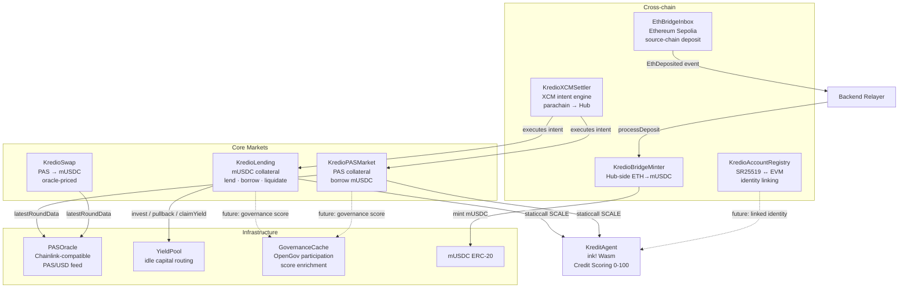

```
 ██████╗ ██████╗ ███╗   ██╗████████╗██████╗  █████╗  ██████╗████████╗███████╗
██╔════╝██╔═══██╗████╗  ██║╚══██╔══╝██╔══██╗██╔══██╗██╔════╝╚══██╔══╝██╔════╝
██║     ██║   ██║██╔██╗ ██║   ██║   ██████╔╝███████║██║        ██║   ███████╗ 
██║     ██║   ██║██║╚██╗██║   ██║   ██╔══██╗██╔══██║██║        ██║   ╚════██║ 
╚██████╗╚██████╔╝██║ ╚████║   ██║   ██║  ██║██║  ██║╚██████╗   ██║   ███████║ 
 ╚═════╝ ╚═════╝ ╚═╝  ╚═══╝   ╚═╝   ╚═╝  ╚═╝╚═╝  ╚═╝ ╚═════╝   ╚═╝   ╚══════╝ 
```

# Kredio Contracts

Solidity smart contracts and ink! credit scoring engine for the Kredio DeFi credit protocol, deployed on **Polkadot Asset Hub EVM** (chain ID `420420417`). Built with **Foundry** for the EVM layer and **ink!** / Rust for the Substrate-native scoring contract.

---

## Table of Contents

1. [Overview](#overview)
2. [Directory Structure](#directory-structure)
3. [Contract Reference](#contract-reference)
   - [KredioLending](#krediolending)
   - [KredioPASMarket](#krediopasmarket)
   - [KredioSwap](#kredioswap)
   - [KredioBridgeMinter](#krediobridgeminter)
   - [EthBridgeInbox](#ethbridgeinbox)
   - [KredioXCMSettler](#kredioxcmsettler)
   - [KredioAccountRegistry](#kredioaccountregistry)
   - [KreditAgent (ink!)](#kreditagent-ink)
   - [GovernanceCache](#governancecache)
   - [PASOracle](#pasoracle)
   - [USD Coin (mUSDC)](#usd-coin-musdc)
   - [YieldPool](#yieldpool)
4. [Credit Scoring System](#credit-scoring-system)
5. [Deployed Addresses (Paseo Testnet)](#deployed-addresses-paseo-testnet)
6. [Prerequisites](#prerequisites)
7. [Build](#build)
8. [Deploy](#deploy)
   - [Core Protocol (Asset Hub)](#core-protocol-asset-hub)
   - [Bridge Contracts](#bridge-contracts)
   - [Yield Strategy Components](#yield-strategy-components)
9. [Environment Variables](#environment-variables)
10. [Testing](#testing)
11. [Foundry Configuration](#foundry-configuration)

---

## Overview

The Kredio contract suite is a hybrid Solidity + ink! system running on Polkadot Asset Hub EVM. The EVM contracts handle capital flows, position management, and protocol actions. The ink! contract (`KreditAgent`) implements the deterministic credit scoring algorithm. The two layers communicate via Asset Hub's unique cross-VM capability: Solidity contracts make low-level `staticcall` invocations to the Wasm contract using SCALE-encoded selectors.

This hybrid architecture is unique to Polkadot — no other ecosystem supports cross-calling between an EVM contract and a Wasm contract within the same block and execution context.

---

## Contract Architecture




---

## Directory Structure

```
contracts/
├── foundry.toml                  ← Foundry project configuration
├── addresses-latest.md           ← Current deployed addresses & deploy log
├── calc.py                       ← Off-chain yield/interest calculation helper
├── evm/                          ← Solidity smart contracts
│   ├── KredioLending.sol         ← mUSDC lending & credit-scored borrowing
│   ├── KredioPASMarket.sol       ← PAS collateral market
│   ├── KredioSwap.sol            ← PAS → mUSDC oracle-priced swap
│   ├── KredioBridgeMinter.sol    ← Hub-side ETH→mUSDC bridge minter
│   ├── EthBridgeInbox.sol        ← Source-chain ETH deposit inbox
│   ├── KredioXCMSettler.sol      ← XCM intent engine
│   ├── KredioAccountRegistry.sol ← SR25519 identity linking
│   ├── GovernanceCache.sol       ← On-chain OpenGov participation cache
│   ├── MockPASOracle.sol         ← Chainlink-compatible PAS/USD oracle
│   ├── MockUSDC.sol              ← Protocol stablecoin (mUSDC)
│   ├── MockYieldPool.sol         ← External yield source
│   └── interfaces/
│       ├── IPASOracle.sol        ← Oracle interface
│       ├── IGovernanceCache.sol  ← Governance cache interface
│       └── IKreditAgent.sol      ← KreditAgent documentation interface
├── kredit_agent/                 ← ink! credit scoring contract (Rust)
│   ├── Cargo.toml
│   └── lib.rs                    ← Full credit scoring implementation
├── script/                       ← Foundry deploy scripts
│   ├── Deploy.s.sol              ← Full core protocol deployment
│   ├── DeployBridge.s.sol        ← Bridge inbox + minter deployment
│   └── DeployYieldStrategy.s.sol ← Yield strategy component deployment
├── test/                         ← Foundry test suite
├── broadcast/                    ← Foundry broadcast receipts (generated)
├── cache/                        ← Foundry build cache (generated)
└── lib/                          ← Foundry dependencies (forge install)
    ├── forge-std/
    └── openzeppelin-contracts/
```

---

## Contract Reference

### KredioLending

**`evm/KredioLending.sol`** — deployed on Asset Hub

The primary lending pool for mUSDC-collateralised borrowing.

**Lender functions:**
- `deposit(uint256 amount)` — supply mUSDC liquidity; earns proportional yield
- `withdraw(uint256 amount)` — retrieve deposited mUSDC plus pending yield
- `pendingYieldAndHarvest(address user)` — harvest accumulated yield without withdrawing principal

**Borrower functions:**
- `depositCollateral(uint256 amount)` — post mUSDC collateral
- `withdrawCollateral()` — withdraw collateral (must have no open debt)
- `borrow(uint256 amount)` — open a loan; collateral ratio and interest rate set by KreditAgent score
- `repay()` — repay full debt (principal + accrued interest); increments on-chain repayment counter
- `healthRatio(address borrower)` — returns current health: `collateral / (debt × collateralRatioBps / 10000)`

**Liquidation:**
- `liquidate(address borrower)` — callable by anyone when `healthRatio < 1.0`; caller seizes collateral
- `adminLiquidate(address borrower)` — admin-only; same mechanic

**Yield strategy (admin-only):**
- `adminSetYieldPool(address pool)` — wire an external yield pool for idle capital routing
- `adminInvest(uint256 amount)` — move idle capital into yield pool
- `adminPullback(uint256 amount)` — retrieve capital from yield pool
- `adminClaimYield()` — claim accrued yield and distribute to lenders

**Yield distribution:** Interest paid on repayment and claimed yield both flow through `_distributeInterest()`, which updates `accYieldPerShare`. Lenders' shares are settled lazily on the next deposit/withdraw/harvest, making the pool gas-efficient regardless of lender count.

---

### KredioPASMarket

**`evm/KredioPASMarket.sol`** — deployed on Asset Hub

Borrowing market backed by **native PAS token** collateral.

**Collateral & borrowing:**
- `depositCollateral()` — `payable`; deposits `msg.value` PAS as collateral
- `withdrawCollateral()` — withdraws PAS collateral (position must be fully repaid)
- `borrow(uint256 amount)` — draw mUSDC against collateral at oracle LTV; rate set by KreditAgent
- `repay()` — repay full position; transfers debt + accrued interest from borrower

**Oracle integration:** Uses `IPASOracle.latestRoundData()` (Chainlink-compatible) for live PAS/USD pricing. A configurable `stalenessLimit` (default 3600 seconds) reverts borrows and liquidations if the oracle data is too old.

**Lender side:** mUSDC deposited by lenders earns yield in the same accumulator pattern as KredioLending.

**Risk parameters (admin-settable):**
- `ltvBps` — max loan-to-value ratio (default 65%)
- `liqBonusBps` — liquidation bonus paid to liquidator (default 8%)
- `stalenessLimit` — maximum oracle age in seconds
- `protocolFeeBps` — fraction of interest retained by protocol (max 20%)

**Governance score inputs:** Lifetime cumulative deposits (`totalDepositedEver`) and first-seen block (`firstSeenBlock`) are stored per user and passed to KreditAgent on every borrow call, ensuring the score reflects the full history of the borrower.

---

### KredioSwap

**`evm/KredioSwap.sol`** — deployed on Asset Hub

A single-direction swap contract: send native PAS, receive mUSDC at oracle price.

- `quoteSwap(uint256 pasWei)` — returns mUSDC out for a given PAS input (read-only, no gas)
- `swap(uint256 minMUSDCOut)` — `payable`; executes swap with slippage protection
- Fee: `feeBps` (default 0.3%, maximum 1%)

The oracle integrates a crash circuit-breaker: if `oracle.isCrashed()` returns true, all quotes and swaps revert until the oracle recovers.

---

### KredioBridgeMinter

**`evm/KredioBridgeMinter.sol`** — deployed on Asset Hub

Hub-side contract for the cross-chain ETH→mUSDC bridge.

- `processDeposit(sourceTxHash, sourceChainId, sourceUser, hubRecipient, ethAmount)` — called by the authorised backend relayer; mints mUSDC to `hubRecipient`
- `initiateRedeem(sourceTxHash, amount)` — called by `hubRecipient` to burn mUSDC before the backend sends ETH back to the source chain
- `getUserDeposits(user)` — returns all deposit records for a hub recipient

Replay protection: each `sourceTxHash` can only be processed once (`AlreadyProcessed` error prevents double-minting).

---

### EthBridgeInbox

**`evm/EthBridgeInbox.sol`** — deployed on Ethereum Sepolia

Source-chain deposit contract. Users send ETH here; the emitted `EthDeposited` event is picked up by the backend relayer.

- `deposit(address hubRecipient)` — `payable`; enforces per-deposit min/max limits
- Emits: `EthDeposited(depositor, ethAmount, hubRecipient)`
- Owner can update min/max deposit bounds

---

### KredioXCMSettler

**`evm/KredioXCMSettler.sol`** — deployed on Asset Hub

Cross-chain intent settlement engine. Receives encoded intent payloads via XCM `Transact` calls from authorised parachains and executes the corresponding action in the Kredio protocol suite.

**Supported intents:**

| Code | Intent | Action |
|------|--------|--------|
| `0x01` | `DEPOSIT_COLLATERAL` | Post PAS to KredioPASMarket |
| `0x02` | `BORROW` | Draw mUSDC on KredioPASMarket |
| `0x03` | `REPAY` | Repay PAS market position |
| `0x04` | `DEPOSIT_LEND` | Supply mUSDC to KredioLending |
| `0x05` | `SWAP_AND_LEND` | Swap PAS → mUSDC, then deposit |
| `0x06` | `SWAP_AND_BORROW_COLLATERAL` | Swap PAS → mUSDC, use as collateral |
| `0x07` | `WITHDRAW_COLLATERAL` | Release collateral |
| `0x08` | `FULL_EXIT` | Repay debt + withdraw collateral |

Settlement history is tracked per originating account via `settlementHistory` and `intentNonce`, providing a full audit trail of cross-chain actions.

---

### KredioAccountRegistry

**`evm/KredioAccountRegistry.sol`** — deployed on Asset Hub

Links a Substrate (SR25519) identity to an EVM address with cryptographic proof or admin attestation.

- `linkAccount(substrateKey, signature)` — verifies the SR25519 signature over the structured link message and creates a bidirectional mapping
- `attestedLink(evmAddress, substrateKey)` — admin/attester fallback when the on-chain SR25519 precompile is unavailable
- `unlinkAccount()` — removes the link; invalidates all prior signatures via nonce increment

Replay protection: `linkNonce` increments on both link and unlink operations, ensuring a captured signature cannot be replayed after any state change.

One-to-one enforcement: attempting to link an already-linked address or key reverts with a descriptive error.

---

### KreditAgent (ink!)

**`kredit_agent/lib.rs`** — deployed on Asset Hub as a Wasm contract

The deterministic on-chain credit scoring engine. Called by both EVM market contracts via low-level SCALE-encoded staticcalls.

**Messages (callable methods):**

| Message | Inputs | Output | Description |
|---------|--------|--------|-------------|
| `compute_score` | `repayments, liquidations, deposit_tier, blocks_since_first` | `u64` (0–100) | Full credit score |
| `collateral_ratio` | `score: u64` | `u64` (basis points) | Required collateral ratio |
| `interest_rate` | `score: u64` | `u64` (basis points) | Annual interest rate |
| `tier` | `score: u64` | `u8` (0–5) | Credit tier index |
| `reasoning` | All score inputs + score | `[u8; 256]` | Human-readable score breakdown |

**Score component breakdown:**

| Component | Max Points | Inputs |
|-----------|-----------|--------|
| Repayment history | 55 pts | `repayments` (logarithmic scale), minus `liquidations` penalty |
| Lending volume | 35 pts | `deposit_tier` (0–7, set by cumulative lifetime deposits) |
| Account age | 10 pts | `blocks_since_first` |

**EVM interop:** Solidity contracts call the ink! contract using `staticcall` with manually packed SCALE-encoded calldata. The relevant selectors are:

```solidity
bytes4 internal constant SEL_COMPUTE_SCORE   = 0x3a518c00;
bytes4 internal constant SEL_COLLATERAL_RATIO = 0xa70eec89;
bytes4 internal constant SEL_INTEREST_RATE   = 0xb8dc60f2;
bytes4 internal constant SEL_TIER            = 0x2b2bb477;
```

---

### GovernanceCache

**`evm/GovernanceCache.sol`** — deployed on Asset Hub

Stores a summary of each user's Polkadot OpenGov participation on-chain, written by an authorised admin/oracle.

- `setGovernanceData(user, voteCount, maxConviction)` — admin writes
- `getGovernanceData(user)` — returns `(voteCount, maxConviction, cachedAt)`

In a full production integration, this cache would be populated by an automated indexer monitoring on-chain governance events via Substrate RPC or Subquery, enabling governance participation to directly influence credit scoring.

---

### PASOracle

**`evm/MockPASOracle.sol`** — deployed on Asset Hub

A Chainlink `AggregatorV3`-compatible price feed for PAS/USD, updatable by the authorised owner (the backend oracle service in the current deployment).

- `setPrice(int256 price)` — updates the on-chain price; reverts if in crash mode
- `latestRoundData()` — standard Chainlink interface; returns `(roundId, answer, startedAt, updatedAt, answeredInRound)`
- `crash(int256 crashPrice)` — sets a crash price, halting normal price updates
- `recover()` — restores the last normal price

In a production deployment on mainnet Polkadot, this would be replaced by a decentralised oracle such as a Chainlink feed deployed on Asset Hub or an Acurast-powered off-chain oracle computation.

---

### USD Coin (mUSDC)

**`evm/MockUSDC.sol`** — deployed on Asset Hub

The protocol stablecoin — a standard ERC-20 with a public `mint()` function for testnet use. On mainnet, this would be replaced by the canonical bridged USDC (Circle's CCTP on Polkadot, or a Polkadot-native stablecoin).

- 6 decimal places (matching USDC standard)
- Public faucet: anyone can call `mint(address to, uint256 amount)` on testnet

---

### YieldPool

**`evm/MockYieldPool.sol`** — deployed on Asset Hub

External yield source integrated with `KredioLending` for idle capital management.

- `deposit(uint256 amount)` — KredioLending deposits idle mUSDC
- `withdraw(address to, uint256 amount)` — KredioLending withdraws capital
- `claimYield(address to)` — distributes accrued yield to the lending contract
- `pendingYield(address who)` — view current accrued yield

Yield accrues at a configurable APY rate (`yieldRateBps`). In a production deployment, this would be an integration with a live yield source — for example a Polkadot-native liquidity pool, a parachain lending market, or a cross-chain yield aggregator — routing idle Kredio liquidity to the highest available return.

---

## Credit Scoring System

The scoring model is fully deterministic and all inputs live on-chain:

```
score = repayment_points(repayments, liquidations)
      + deposit_points(deposit_tier)
      + age_points(blocks_since_first)
```

**Repayment points (max 55):**

| Repayments | Base points |
|-----------|-------------|
| ≥ 12 | 55 |
| ≥ 8 | 46 |
| ≥ 5 | 36 |
| ≥ 3 | 26 |
| ≥ 2 | 16 |
| ≥ 1 | 8 |
| 0 | 0 |

Liquidation penalties: −20 pts (1 liquidation), −35 pts (2), −55 pts (3+).

**Deposit tier points (max 35):**

| Tier | Points | Approx. USDC threshold |
|------|--------|----------------------|
| 7 | 35 | Highest bracket |
| 6 | 30 | |
| 5 | 25 | |
| 4 | 20 | |
| 3 | 15 | |
| 2 | 10 | |
| 1 | 5 | |
| 0 | 0 | New user |

**Account age points (max 10):**

| Blocks since first deposit | Points |
|---------------------------|--------|
| ≥ 10,000 | 10 |
| ≥ 2,000 | 5 |
| ≥ 500 | 2 |
| < 500 | 0 |

**Resulting tiers:**

| Tier | Score | Collateral Ratio | Interest Rate |
|------|-------|-----------------|---------------|
| ANON | 0–14 | 200% | 15% APR |
| BRONZE | 15–29 | 175% | 12% APR |
| SILVER | 30–49 | 150% | 10% APR |
| GOLD | 50–64 | 130% | 8% APR |
| PLATINUM | 65–79 | 120% | 6% APR |
| DIAMOND | 80–100 | 110% | 4% APR |

---

## Deployed Addresses (Paseo Testnet)

Network: **Polkadot Asset Hub Testnet**
Chain ID: `420420417`
RPC: `https://eth-rpc-testnet.polkadot.io/`
Explorer: `https://blockscout-testnet.polkadot.io`

| Contract | Address |
|----------|---------|
| KredioLending | `0x1eDaD1271FB9d1296939C6f4Fb762752b041C64E` |
| KredioPASMarket | `0x0F90Fe6141AC29a6031C3ae2155749e9f38a0174` |
| KredioSwap | `0xaF1d183F4550500Beb517A3249780290A88E6e39` |
| KredioBridgeMinter | (see addresses-latest.md) |
| KredioXCMSettler | `0xbaaE8f7b97ac387DE8C433A218d63166Ce104Bb1` |
| KredioAccountRegistry | `0xBf7ac0e6f0024ED0F2Cf2efb3669E7c389258BFf` |
| KreditAgent (ink!) | `0x8c13E6fFDf27bB51304Efff108C9B646d148E5F3` |
| PASOracle | `0x1494432a8Af6fa8c03C0d7DD7720E298D85C55c7` |
| mUSDC | `0x5998cE005b4f3923c988Ae31940fAa1DEAC0c646` |
| GovernanceCache | `0xe4DE7eadE2c0A65BdA6863Ad7bA22416c77F3e55` |
| YieldPool | `0x1dB4Faad3081aAfe26eC0ef6886F04f28D944AAB` |

Full deployment history is in [addresses-latest.md](addresses-latest.md).

---

## Prerequisites

| Tool | Version | Install |
|------|---------|---------|
| Foundry (`forge`, `cast`) | Latest | `curl -L https://foundry.paradigm.xyz \| bash && foundryup` |
| Node.js | ≥ 18 | For scripts/seeding only |
| Rust + ink! | For KreditAgent only | `rustup target add wasm32-unknown-unknown && cargo install cargo-contract` |

---

## Build

```bash
cd contracts

# Install Foundry dependencies
forge install

# Compile all Solidity contracts
forge build

# Output: out/ directory with ABI + bytecode JSONs
```

After building, copy the relevant ABI files to `backend/abis/` if you need to update them:

```bash
cp out/KredioLending.sol/KredioLending.json ../backend/abis/
cp out/KredioPASMarket.sol/KredioPASMarket.json ../backend/abis/
# etc.
```

### Building the KreditAgent (ink!)

```bash
cd kredit_agent
cargo contract build --release
# Output: target/ink/kredit_agent.contract (uploadable bundle)
```

---

## Deploy

### Environment setup

Create `contracts/.env`:

```env
ADMIN=<private_key_hex>          # No 0x prefix (Foundry convention)
PRIVATE_KEY=<private_key_hex>    # Same key, used by bridge deploy scripts
PASSET_RPC=https://eth-rpc-testnet.polkadot.io/
SEPOLIA_RPC=https://rpc.sepolia.org
ETHERSCAN_KEY=<optional_for_verification>
```

### Core Protocol (Asset Hub)

Deploys: `KredioLending`, `KredioPASMarket`, `KredioXCMSettler`, `KredioAccountRegistry`, `YieldPool`.

Reuses existing: `mUSDC`, `GovernanceCache`, `PASOracle`, `KreditAgent`, `KredioSwap`.

```bash
cd contracts
source .env

forge script script/Deploy.s.sol \
  --rpc-url $PASSET_RPC \
  --broadcast \
  --private-key $ADMIN \
  -vvv
```

The script automatically:
1. Deploys a fresh `YieldPool`
2. Deploys `KredioLending` and wires the yield pool
3. Deploys `KredioPASMarket`
4. Deploys `KredioXCMSettler`
5. Deploys `KredioAccountRegistry`
6. Seeds both pools with mUSDC liquidity

After deployment:
- Update `backend/.env` with the new addresses
- Update `frontend/config/contracts.ts` with the new addresses

---

### Bridge Contracts

#### Step 1 — Deploy EthBridgeInbox on Ethereum Sepolia

```bash
forge script script/DeployBridge.s.sol:DeployInbox \
  --rpc-url $SEPOLIA_RPC \
  --chain-id 11155111 \
  --private-key $PRIVATE_KEY \
  --broadcast \
  --verify \
  --etherscan-api-key $ETHERSCAN_KEY
```

Note the deployed `EthBridgeInbox` address.

#### Step 2 — Deploy KredioBridgeMinter on Asset Hub

```bash
forge script script/DeployBridge.s.sol:DeployMinter \
  --rpc-url $PASSET_RPC \
  --chain-id 420420417 \
  --private-key $PRIVATE_KEY \
  --broadcast
```

#### Step 3 — Configure

Set in `backend/.env`:
```env
INBOX_ADDR_11155111=<EthBridgeInbox address>
MINTER_ADDR=<KredioBridgeMinter address>
```

Set in `frontend/.env.local`:
```env
NEXT_PUBLIC_INBOX_SEPOLIA=<EthBridgeInbox address>
NEXT_PUBLIC_BRIDGE_MINTER=<KredioBridgeMinter address>
```

---

### Yield Strategy Components

To deploy a fresh `YieldPool` and a new `KredioLending` wired to it:

```bash
forge script script/DeployYieldStrategy.s.sol \
  --rpc-url $PASSET_RPC \
  --broadcast \
  --private-key $PRIVATE_KEY \
  -vvv
```

Post-deploy:
1. Update `LENDING_ADDR` in `backend/.env`
2. Update `YIELD_POOL_ADDR` in `backend/.env`
3. Set `YIELD_STRATEGY_ENABLED=true` in `backend/.env`
4. Update `KREDIOLENDING` and `MOCKYIELDPOOL` in `frontend/config/contracts.ts`

---

## Environment Variables

`contracts/.env` (used by all Foundry scripts):

```env
# ── Keys (no 0x prefix) ─────────────────────────────────────────────────────
ADMIN=<private_key>          # Used by Deploy.s.sol
PRIVATE_KEY=<private_key>    # Used by DeployBridge.s.sol and DeployYieldStrategy.s.sol

# ── RPCs ─────────────────────────────────────────────────────────────────────
PASSET_RPC=https://eth-rpc-testnet.polkadot.io/
SEPOLIA_RPC=https://rpc.sepolia.org

# ── Optional ──────────────────────────────────────────────────────────────────
ETHERSCAN_KEY=             # For contract verification on Sepolia
```

---

## Testing

```bash
cd contracts

# Run all tests
forge test

# Run with verbosity (shows logs and traces)
forge test -vvv

# Run a specific test file
forge test --match-path test/KredioLending.t.sol -vvv

# Gas report
forge test --gas-report
```

The test suite covers:
- Full borrower journeys (deposit → borrow → repay → score improvement)
- Liquidation scenarios (under-collateralised position seizure)
- Interest accrual and distribution correctness
- KreditAgent score computation edge cases
- Bridge minting and redemption flows
- Oracle staleness protection

---

## Foundry Configuration

`foundry.toml`:

```toml
[profile.default]
src            = "evm"
test           = "test"
script         = "script"
out            = "out"
libs           = ["lib"]
solc_version   = "0.8.24"
optimizer      = true
optimizer_runs = 200
via_ir         = true
extra_output   = ["abi", "evm.bytecode"]

[rpc_endpoints]
hub_testnet = "${PASSET_RPC}"
sepolia     = "${SEPOLIA_RPC}"
```

`via_ir = true` enables the Yul intermediate representation pipeline, which is required for some of the more complex contract patterns and produces better optimised bytecode.
