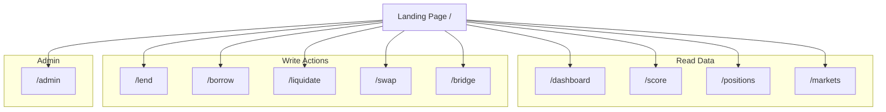
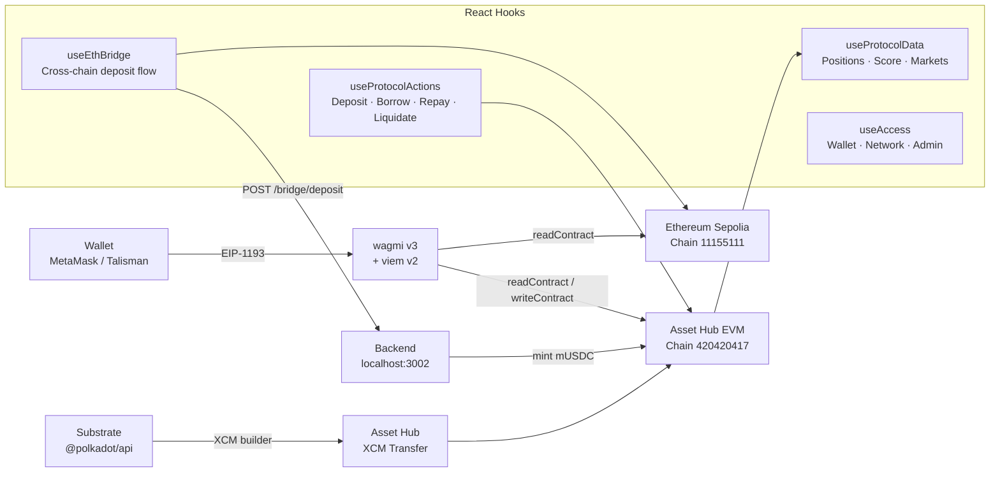

```
 ██████╗██╗     ██╗███████╗███╗   ██╗████████╗
██╔════╝██║     ██║██╔════╝████╗  ██║╚══██╔══╝
██║     ██║     ██║█████╗  ██╔██╗ ██║   ██║   
██║     ██║     ██║██╔══╝  ██║╚██╗██║   ██║   
╚██████╗███████╗██║███████╗██║ ╚████║   ██║   
 ╚═════╝╚══════╝╚═╝╚══════╝╚═╝  ╚═══╝   ╚═╝   
```

# Kredio Frontend

Next.js 16 dApp for the Kredio cross-chain DeFi credit protocol, deployed on **Polkadot Asset Hub EVM** (chain ID `420420417`).

---

## Table of Contents

1. [Overview](#overview)
2. [Tech Stack](#tech-stack)
3. [Directory Structure](#directory-structure)
4. [Pages](#pages)
5. [Hooks](#hooks)
6. [Lib & Utilities](#lib--utilities)
7. [Config](#config)
8. [Components](#components)
9. [Environment Variables](#environment-variables)
10. [Running Locally](#running-locally)
11. [Building for Production](#building-for-production)
12. [Chain & Wallet Configuration](#chain--wallet-configuration)

---

## Overview

The Kredio frontend is a full-featured DeFi dApp providing:

- Lend & borrow against mUSDC or native PAS collateral
- Live credit score and tier display
- Liquidation dashboard
- Position management
- Native PAS ↔ mUSDC swap
- Cross-chain ETH bridge (Ethereum → Polkadot Asset Hub)
- Admin control panel for protocol management
- Landing page with protocol topology and tier visualisation

It uses **wagmi v3** + **viem v2** for EVM interactions, **@polkadot/api** for Substrate connectivity, and **@paraspell/sdk-pjs** for XCM message construction.

---

## Tech Stack

| Package | Purpose |
|---------|---------|
| Next.js 16 (App Router) | Framework, SSR, routing |
| React 19 | UI rendering |
| TypeScript 5 | Type safety |
| Tailwind CSS 4 | Utility-first styling |
| wagmi v3 | EVM wallet & contract hooks |
| viem v2 | Low-level EVM interactions |
| RainbowKit v2 | Wallet connection modal |
| @polkadot/api v16 | Substrate RPC & extrinsics |
| @polkadot/extension-dapp | Polkadot.js / Talisman wallet integration |
| @paraspell/sdk-pjs | XCM transfer builder for parachain → Hub |
| polkadot-api v1 | Typed PAPI client |
| @tanstack/react-query v5 | Async state & caching |
| Framer Motion | Page and component animations |
| Zustand | Lightweight global state |
| Sonner | Toast notifications |
| Lucide React | Icon set |

---

## Directory Structure

```
frontend/
├── app/                     ← Next.js App Router (pages + layouts)
│   ├── layout.tsx           ← Root layout with providers
│   ├── page.tsx             ← Landing page
│   ├── admin/               ← Protocol admin panel
│   ├── borrow/              ← Borrowing interface
│   ├── bridge/              ← ETH → Hub cross-chain bridge
│   ├── dashboard/           ← Protocol metrics overview
│   ├── lend/                ← Lender deposit/withdrawal UI
│   ├── liquidate/           ← Liquidation dashboard
│   ├── markets/             ← Market statistics
│   ├── positions/           ← User position management
│   ├── score/               ← Live credit score viewer
│   └── swap/                ← PAS ↔ mUSDC swap
├── components/
│   ├── landing-modules/     ← Landing page sections
│   │   ├── HeroSection      ← Above-the-fold hero
│   │   ├── TopologySection  ← Protocol architecture diagram
│   │   ├── FeaturesSection  ← Key features grid
│   │   ├── TiersSection     ← Credit tier table
│   │   ├── CTASection       ← Call-to-action
│   │   └── FooterSection    ← Footer
│   ├── modules/             ← Reusable protocol UI components
│   └── providers/
│       └── ActionLogProvider ← Global transaction action log
├── config/
│   └── contracts.ts         ← All deployed contract addresses & inline ABIs
├── hooks/
│   ├── useAccess.ts         ← Wallet connection state & admin check
│   ├── useEthBridge.ts      ← ETH bridge deposit flow
│   ├── useProtocolActions.ts ← Write actions: deposit, borrow, repay, liquidate
│   └── useProtocolData.ts   ← Read hooks: market data, score, positions
├── lib/
│   ├── action-log.ts        ← Transaction log types & store
│   ├── addresses.ts         ← Typed protocol address configuration
│   ├── addresses.hubTestnet.json ← Static address snapshot (fallback)
│   ├── constants.ts         ← All contract ABIs (parsed by viem)
│   ├── input.ts             ← Input parsing utilities
│   ├── tokens.ts            ← Token registry (PAS, mUSDC)
│   ├── utils.ts             ← Formatting helpers
│   ├── wagmi.ts             ← Wagmi config + custom chain definitions
│   └── xcm.ts               ← XCM transfer logic, SS58 utilities, People chain balance
├── public/
│   └── assets/              ← Static images and icons
├── scripts/
│   └── seed.mjs             ← Admin seeding script (off-chain helper)
├── styles/
│   └── theme.css            ← Global CSS variables and theme tokens
├── next.config.ts           ← Next.js configuration
├── tailwind.config.ts       ← Tailwind theme extensions
└── tsconfig.json            ← TypeScript compiler options
```

---

## Pages



### `/` — Landing Page
Protocol overview with animated sections: hero, topology diagram, features, credit tier breakdown, and CTA. Uses smooth scroll-snap for full-page section navigation.

### `/dashboard` — Dashboard
Live read-only protocol metrics: total deposited, total borrowed, utilisation rates for both markets, PAS/USD oracle price and status, and recent protocol activity.

### `/score` — Credit Score
Displays the connected wallet's live Kredit score (0–100), current tier (ANON → DIAMOND), collateral ratio, and interest rate. Shows the inputs driving the score: repayment count, liquidation count, deposit tier, and account age.

### `/lend` — Lend
- Deposit mUSDC into the lending pool
- Withdraw deposited mUSDC
- Harvest accumulated yield in one click
- Live display of deposit balance and pending yield

### `/borrow` — Borrow
Two-market borrowing UI:
- **Lending Market**: deposit mUSDC collateral, borrow mUSDC
- **PAS Market**: deposit native PAS collateral, borrow mUSDC at oracle price

Both panels show live position state including collateral, debt, accrued interest, health ratio, and credit tier.

### `/positions` — Positions
Full management view of open positions in both markets. Shows real-time health, total owed including accrued interest, and repay/withdraw buttons.

### `/liquidate` — Liquidate
Scans both markets for undercollateralised positions. Any connected wallet can trigger liquidation and receive the collateral bonus.

### `/swap` — Swap
Swap native PAS for mUSDC using the on-chain oracle price. Shows live quote, 0.3% fee breakdown, and reserve balance.

### `/bridge` — Bridge
Cross-chain ETH → mUSDC bridge flow:
1. User selects a source chain (Ethereum Sepolia)
2. Fetches a live quote from the backend (ETH/USD price, bridge fee)
3. User approves and deposits ETH to the `EthBridgeInbox` on the source chain
4. Frontend polls the backend to confirm relay and minting on Asset Hub

### `/markets` — Markets
Aggregate market data: total protocol TVL, utilisation per market, oracle price history, and tier distribution of active borrowers.

### `/admin` — Admin Panel
Admin-only interface (gated by deployer address check) for:
- Force-closing positions
- Bulk withdrawing deposits
- Setting global demo rate multipliers
- Updating oracle prices manually
- Resetting user scores
- Managing risk parameters

---

## Hooks



### `useAccess`
```ts
const { address, isConnected, isAdmin, isWrongNetwork } = useAccess();
```
Returns wallet state and checks if the connected address is the protocol admin. `isWrongNetwork` is true if connected but not on chain ID `420420417`.

### `useProtocolData`
Provides reactive read-only views into protocol state:
- `useGlobalProtocolData()` — both market snapshots and oracle state
- `useUserPositionData()` — user's deposits, collateral, debt, pending yield, score
- `useScoreSnapshot()` — live Kredit score, tier, rates

All hooks poll on a configurable interval and expose a `refresh()` callback.

### `useProtocolActions`
Encapsulates all write transactions with:
- Automatic wallet and network validation
- Action log entries for each state transition
- Receipt awaiting before resolving

Available actions: `deposit`, `withdraw`, `harvestYield`, `depositCollateral`, `withdrawCollateral`, `borrow`, `repay`, `liquidate`, `approveMUSDC`, swap via `KredioSwap`.

### `useEthBridge`
Full ETH bridge deposit lifecycle:
1. Auto-switches wallet chain to the selected source chain
2. Sends ETH to `EthBridgeInbox` and awaits receipt
3. Polls backend `/bridge/deposit` to relay and mint mUSDC on Hub
4. Returns typed status stages: `idle → switching-chain → depositing → awaiting-receipt → verifying → minting → minted`

---

## Lib & Utilities

### `lib/wagmi.ts`
Defines the custom `passetHub` chain (Polkadot Asset Hub EVM testnet, chain ID `420420417`) and configures wagmi with both Asset Hub and Sepolia. Uses `injected()` connector so any EIP-1193 wallet (MetaMask, Talisman EVM mode) works.

### `lib/xcm.ts`
XCM utilities for Substrate-side interactions:
- `sendXcm(params)` — builds and submits an XCM transfer from PeopleChain → Asset Hub using `@paraspell/sdk-pjs`
- `pollHubArrival(params)` — polls the Hub EVM balance until the XCM-transferred PAS arrives
- `h160ToSS58(evmAddress)` — converts a 20-byte EVM address to the corresponding SS58 address on Asset Hub (using the H160 padding scheme Asset Hub uses for EVM-Substrate account equivalence)
- `fetchPeopleBalance(ss58)` — fetches native PAS balance from the PeopleChain via WebSocket

### `lib/constants.ts`
All contract ABIs in `parseAbi` format for type-safe viem usage: `KREDIO_LENDING`, `KREDIO_PAS_MARKET`, `KREDIT_AGENT`, `PAS_ORACLE`, `ERC20`, `MOCK_ASSET`, `BRIDGE_MINTER`, `BRIDGE_INBOX`.

### `lib/tokens.ts`
Token registry defining metadata for `PAS` (native) and `mUSDC` (6-decimal protocol stablecoin) — symbols, decimals, asset IDs, UI badge colours, and faucet amounts.

### `lib/addresses.ts`
Typed `NetworkConfig` object derived from `config/contracts.ts`, exposing all protocol addresses and chain config as a single typed import.

---

## Config

### `config/contracts.ts`
Single source of truth for all deployed contract addresses and inline ABIs. Update this file after any redeployment.

```ts
export const CONTRACTS = {
    KREDIOLENDING:   '0x1eDaD1271FB9d1296939C6f4Fb762752b041C64E',
    KREDIOPASMARKET: '0x0F90Fe6141AC29a6031C3ae2155749e9f38a0174',
    KREDIOSWAP:      '0xaF1d183F4550500Beb517A3249780290A88E6e39',
    MOCKUSDC:        '0x5998cE005b4f3923c988Ae31940fAa1DEAC0c646',
    MOCKPASORACLE:   '0x1494432a8Af6fa8c03C0d7DD7720E298D85C55c7',
    GOVERNANCECACHE: '0xe4de7eade2c0a65bda6863ad7ba22416c77f3e55',
    KREDITAGENT:     '0x8c13E6fFDf27bB51304Efff108C9B646d148E5F3',
    MOCKYIELDPOOL:   '0x1dB4Faad3081aAfe26eC0ef6886F04f28D944AAB',
    CHAIN_ID:        420420417,
    RPC:             'https://eth-rpc-testnet.polkadot.io/',
    EXPLORER:        'https://blockscout-testnet.polkadot.io',
    FAUCET:          'https://faucet.polkadot.io/',
};
```

Bridge addresses are read from environment variables at runtime (see below).

---

## Environment Variables

Create `.env.local` in the `frontend/` directory:

```env
# ── Bridge contract addresses ──────────────────────────────────────────────
NEXT_PUBLIC_INBOX_SEPOLIA=0x...      # EthBridgeInbox on Ethereum Sepolia
NEXT_PUBLIC_BRIDGE_MINTER=0x...     # KredioBridgeMinter on Asset Hub

# ── Backend service ────────────────────────────────────────────────────────
NEXT_PUBLIC_BACKEND_URL=http://localhost:3002

# ── Optional overrides ─────────────────────────────────────────────────────
# These are only needed if you redeploy contracts to a different address.
# Normally the values in config/contracts.ts are used directly.
```

All `NEXT_PUBLIC_*` variables are inlined at build time and exposed to the browser. **Never put private keys or server-side secrets in `NEXT_PUBLIC_` variables.**

---

## Running Locally

### Prerequisites
- Node.js ≥ 18
- A browser wallet: MetaMask or Talisman (EVM mode)
- The backend service running at `http://localhost:3002` (see [backend/README.md](../backend/README.md))

### Steps

```bash
# From the repo root
cd frontend

# Install dependencies
npm install

# Create env file and fill in values
cp .env.local.example .env.local

# Start development server
npm run dev
```

Open [http://localhost:3000](http://localhost:3000) in your browser.

**Connect your wallet** and switch to **Polkadot Hub Paseo Testnet**. The dApp will prompt you to add the network automatically if it is not already in your wallet.

**Get testnet tokens:**
- PAS: [https://faucet.polkadot.io/](https://faucet.polkadot.io/)
- mUSDC: Use the **Mint mUSDC** button in the wallet panel (calls the public faucet function on the stablecoin contract)

---

## Building for Production

```bash
npm run build    # Next.js production build
npm run start    # Start production server
npm run lint     # ESLint check
```

---

## Chain & Wallet Configuration

### Supported Networks

| Network | Chain ID | Purpose |
|---------|----------|---------|
| Polkadot Asset Hub Testnet | `420420417` | Primary protocol network |
| Ethereum Sepolia | `11155111` | ETH bridge source chain |

### Adding Asset Hub to MetaMask Manually

| Field | Value |
|-------|-------|
| Network Name | Polkadot Hub Paseo Testnet |
| RPC URL | `https://eth-rpc-testnet.polkadot.io/` |
| Chain ID | `420420417` |
| Currency Symbol | `PAS` |
| Block Explorer | `https://blockscout-testnet.polkadot.io` |

The dApp attempts to auto-add this network via `wallet_addEthereumChain` when you first connect.

### Talisman
Talisman supports both Substrate and EVM accounts. For Kredio, use the EVM account mode. Talisman auto-detects Asset Hub EVM with no manual configuration.
